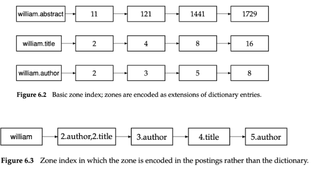

# PRI 2021/2022

## IR concepts

- **Information retrieval (IR)** - is finding material (usually documents) of an
  unstructured nature (usually text) that satisfies an information need from
  within large collections (usually stored on computers).
- **Clustering** - coming up with a good grouping of the documents based on
  their contents.
- **grepping** - linear scan through documents.
- **index** - para cada termo (palavra) dizer se existe num documento =>
  **binary term-document _incidence matrix_**

### Modules

- **Crawling module** - crawls through a set of objects to gather information;
- **Indexing module** - based on the collection documents will index them;
- **Ranking and retrieval module** - based on **IN** (expressed as a query),
  evaluates and ranks the possible results and retrieves them to the user.
- **? Search user interface** - The interface to interact with the system can be
  considered a module.

### Binary term-document _incidence matrix_

- **binary term-document _incidence matrix_** - linha é termo e coluna é
  documento. Célula tem 1 se contém.


Dependendo se olhamos para linhas ou colunas temos vetores de 0s e 1s
diferentes. Query `Brutus AND Caesar AND NOT Calpurnia`, usando os vetores de
cada term (linha) é `110100 AND 110111 AND 101111 = 100100` => Está no _Anthony_
e na _Cleopatra_.

- A matriz fica muito esparsa (no exemplo é 99.8% 0s). Uma representação melhor
  seria listar apenas os 1s (coisas que ocorrem). => **Inverted index**

---

- **Collection**/**Corpus** - é o grupo de documentos em que fazemos pesquisas.
- **Documento** - Unidades em que construimos o IR system sobre.
- **AD HOC retrieval** - o sistema procura devolver documentos, da coleção,
  relevantes para uma **necessidade de informação**. Esta necessidade é
  comunicada ao sistema através de uma one-off query (iniciada pelo utilizador).
- **Necessidade de informação** - é tópico sobre qual o utilizador procura saber
  mais.
- **Query** - forma como user comunica ao sistema a sua **necessidade de
  informação**.
- **Relevância** - um documento é relevante se o utilizador achar que ele contém
  informação de valor em respeito à sua necessidade de informação.
- **Effectiveness** - Medida com base na **Precision** e no **Recall**.

## Inverted Index


- Mapeia de **termos** para **documentos**.
- Mantemos um **dictionary**/**vocabulary**/**lexicon**.
- **Posting list** - Cada **term** tem uma lista que guarda os **documentos** em
  que o **termo** aparece (e também a posição).
- **Posting** - par (termo, docID).
- Dicionário fica ordenada alfabéticamente e os postings por **Document ID**.
- **Document frequency (df)** - **dictionary** também mantém statistics como o
  número de documentos que contêm cada termo => é a length da posting list.

### Processar boolean query

Q: `Brutus AND Calpurnia`

1. Locate `Brutus` in the Dictionary;
2. Retrieve its postings;
3. Locate `Calpurnia` in the Dictionary;
4. Retirve its postings;
5. Intersect the two postings lists.

- **Merge algorithm** - interleaved advance dos pointers de cada lista para
  selecionar o que está em comum (por causa do **AND**) => faz o intersect.

---

### Optimization

- Com vários **AND**s, processamos primeiro as que têm uma posting list mais
  pequenas.
- Com **OR**s, processamos primeiro os lados mais pequenos.

## Document Unit

- What we want to index.
- Related to **index granularity**: precision/recall tradeoff in this decision.
- If the units get too small (sentences), we are likely to miss important
  passages. If thet are too large (books), we tend to get spurious matches and
  the relevant information is hard to find.

## Tokenization

- Dada uma sequência de characteres e uma definida **document unit**,
  **tokenization** é a tarefa de a dividir em partes, chamadas **tokens**.
- **Token** - uma instância de uma sequência de chars num document. É agrupado
  de forma util ao seu processamento semântico.
- **Type** - é a class de todos os **tokens** que contêm a mesma sequência de
  chars.

### Stop words

- São de pouco valor para a seleção de documentos no processo de recuperação.
- **Collection frequency (cf)** - olhamos para o numero de vezes que um termo
  aparece na **collection**. Útil para determinar quais são stop words.

---

### Token Normalization

- Canonizar **tokens** para matches ocurrem apesar da existência de diferenças
  superficiais nas sequência de characteres dos **tokens**.
- Nos acentos, capitalização, stemming, e lemmatization.
- **Stemming** - heuristic process that chops off the ends of words in the hope
  of reducing inflectional forms. Increases **recall** while harming
  **precision**.
- **Lemmatization** - reducing inflectional forms by using vocabularies and the
  morphological analysis of words to find its **lemma**. É AI para **stemming**.

## Term weighting

### Ranked retrieval

- Large collections need matches to be sorted by rank.
- Scenarios onde recall é deterministico (todos os documentos são analisados),
  usando Boolean search.

### Parametric and Zone indexes

- Muitos documentos têm estruturas adicionais e meta-data associada.
- **Parametric indexes** - inverted indexes built for specific parameters or
  fields. Suporta `all docs from author Z containing word Y`.
- **Zones** - similar concept applied to arbitrary free text (portion of a
  document).



### Term Frequency (tf)

- **Term frequency (tf)** - Number of mentions of the term in a document.
- Cada documento tem um **tf** para cada termo la presente.
- Podemos considerar o número de ocorrências de um **term** dentro de um
  documento como o seu **weight**.
- **Bag of words** - quando olhamos para um **document** como um agregar de
  **terms** com os **tf**. Ordem ignorada e número de ocorrência de cada
  **term** é key.

### Inverse Document Frequency (idf)

- **Inverse Document Frequency (idf)** - $log(\frac{N}{df})$, where `N` é o
  numero de documentos na coleção.
- Incorporated in the weight of a term.
- Quanto mais raro um termo numa coleção, maior o seu **idf**.
- Documento que aparece em todo o lado => **0**.

### tf-idf

- Combinar **tf** e **idf** resulta num weighting scheme: `tf-idf = tf * idf`
- Para um termo `t`, num documento `d`, **idf** é:
  - highest quando `t` ocorre muitas vezes num número pequeno de documentos;
  - lower quando o termo ocorre poucas vezes num documento, ou ocorre em muitos
    documentos;
  - lowest quando o termo está em virtualmente todos os documentos.

## Vector Space Model

- **Vector Space Model** - Representação de um set de documentos como vectors
  num espaço vetorial comum.
- Each **document** is represented as a vector, with a component vector for each
  **dictionary term**. **tf-idf** weights are used as components.
- There is one axis for each term for the **document** (vector).

Para cada **term** (por ordem alfabética), pegamos no **td-idf** deles
(componentes do vector).

### Cosine similarity

- Similaridade entre documentos é o cosseno do ângulo formado pelas suas
  representações vetoriais.
- Isto compensa contra o efeito do comprimento do documento.
- $sim(d1, d2) = \frac{V(d1) . V(d2)}{|V(d1)| * |V(d2)|}$
- Maior => mais similares.

### Queries as Vectors

- Queries são vectors num espaço n-dimensional, onde n é o numero de termos na
  query. Basicamente são vistas como documentos muito curtos.
- **Top ranked** results são aquelas que têm maior **cosine similarity**.

## Language Model

### Unigram


### Bigram

- Apoia na probabilidade do **term** anterior.
- $P_{bigram}(t1 . t2 . t3 . t4) = P(t1) * P(t2|t1) * P(t3|t2) * P(t4|t3)$

## Metrics

### Precision-Recall


- **Precision** - fração dos resultados obtidos que é relevante para a
  **necessidade de informação** -
  `#(relevant items retrieved)/#(retrieved items) = P(relevant|retrieved)`.
- **Recall** - fração dos documentos relevantes presentes na **collection** que
  foram returnados pelo sistema -
  `#(relevant items retrieved)/#(relevant items) = P(retrieved|relevant)`.

#### Accuracy

- Data is skewed - 99.9% dos results são não relevants.
- Maximizar **accuracy** => dizer que tudo é não relevant.

---

Recall e precision dão tradeoff uma contra a outra:

- Retrieve all documents => 1 recall, but low precision
- Retrieve no documents => 1 precision, but low recall

### F Measure

- Weighted harmonic mean of recall and precision.
- **F1** - æ = 1/2; ẞ = 1 - default balanced F measure - $\frac{2*P*R}{P + R}$
- Harmonic mean é usada porque a arithmetic mean dá 50% quando pomos, por
  exemplo, o recall a 100% (retrieve de tudo).
- Harmonic mean dá um resultado mais próximo do mínimo.

### PR Curve


- São jagged porque:
  - quando o documento é não relavante, recall mantém e precision baixa -
    diretamente para baixo;
  - quando o document é relavante precision e recall sobem - para cima e
    direita;
- **Interpolated precision** - precision para cada recall é a maior precision
  para os recall, r, maiores ou iguais que o atual, r':
  `pinterp(r) = max p(r'), r'>=r`.

### 11-point interpolated average precision

- Pegamos na precision interpolada para os recall: 0.0, 0.1, 0.2, 0.3, 0.4, 0.5,
  0.6, 0.7, 0.8, 0.9, e 1.0;
- Fazer média aritmética dos valores obtidos para cada ponto nos information
  needs.

### AvP - Average Precision

- Média aritmetica da precisão para os recall correspondentes a documentos
  relevantes.

```
|-----|------|------|------|------|------|------|------|------|------|-----|
| --- | X    |      | X    | X    | X    | X    |      |      |      | X   |
|=====|======|======|======|======|======|======|======|======|======|=====|
| R   | 0.17 | 0.17 | 0.33 | 0.5  | 0.67 | 0.83 | 0.83 | 0.83 | 0.83 | 1.0 |
| P   | 1.0  | 0.5  | 0.67 | 0.75 | 0.8  | 0.83 | 0.71 | 0.63 | 0.56 | 0.6 |
|-----|------|------|------|------|------|------|------|------|------|-----|
```

AvP = $\frac{1 + 0.67 + 0.75 + 0.8 + 0.83 + 0.6}{6}$

#### MAP - Mean Average Precision

- Média das average precisions.

---

### Precision at k (P@k)

- Majority of users do not require high recall.
- What matters are high quality results on the first page.
- Example: R R N N R N R R R R - P@5 = 0.6; P@10 = 0.7
- Problema: Sistema que devolve 10 resultados mas só existe 1 relevante é
  prefeito mas tem baixa precision.

### R-Precision

- Resolve o Problema de P@K.
- The number of relevant documents, R, is used as a cutoff (varia entre
  queries).
- Vamos buscar o top R documentos para a query.
- Vemos quantos são relevantes => r.
- `R-Precision` = $\frac{r}{R}$
- Intimamente ligada a map.

## Relevance judgement

- **Test collection**:
  - A document collection;
  - Test suite of information needs (expressible as queries);
  - A set of relevance judgements: usualmente um binary assessment of R or NR
    for each query-document pair.
- **Ground truth**/**Gold standard** judgement of relevance - é a decisão se um
  documento é R ou N para uma information need.
- Relevance é assessed relative to an information need, not a query.

## Web

### Challenges

- Decentralization of content publication - no central point that keeps track of
  what exists/was changed/was deleted.
- What is the size of the web?
- Content is created massively and in diverse forms: diverse languages, formats,
  quality, and intent.

### Characteristics

- Modeled as a graph - **bowtie model**.
- Web pages point tom and pointed by, other pages.
- **out-links** usually include an _anchor text_.
- **in-degree** - number of in-links to a page.

#### Bowtie model

- **SCC** - (Large) **strongly connected core**;
- **IN** - Large group of pages that link to the **SCC**, but aren't linked back
  from it;
- **OUT** - Large group of pages that is linked by the **SCC**, but doesn't link
  back to it;
- **Tubes** - Link from **IN** to **OUT** without passing through **SCC**;
- **Tendrils** - Smaller pages that link to **IN** or **OUT**. **Tendrils** can
  have **Tendrils** ad nauseam.

### Spam

- There is commercial value with appearing on the top ranked results for a given
  search.
- People spam to manipulate search engine result ranking.
- Techniques such as: cloaking (servir um tipo de conteudo a crawlers e outro a
  user comuns), link farm, link spam, click spam, etc...

### User Characteristics

- Users are not trained on how to write queries or the search operators offered
  by search:
  - 2 or 3 words per search;
  - operators are rarely used
  - precision in the top results is highly valued
  - lightweight result pages prefered
- 3 types of information needs:
  - **Information queries** - seek general info about a topic. Typically there
    isn't a single source of relevant info (users gather info from multiple web
    pages).
  - **Navigational queries** - seek the website or home page of a single entity.
    Users want a to find a specific resource (**Can be cached**).
  - **Transactional queries** - preludes the user performing a transaction on
    the web.

### Signals

- Used to estimate quality.
- Different dimensions:
  - query-independent (**static**): titulo, autor, data da ultima modificacao do
    doc;
  - query-dependent (**dynamic**): hora da query, posiçao geografica do user,
    info sobre o user;
  - document-based (content or structural), e.g.: HTML;
  - Collection-based, e.g.: Links;
  - User-based, e.g.: Clicks;

### Web crawling

- Musts: **robust** to problems and traps + **politeness** to web hosts;
- Shoulds: **distributed** execution + **scalable** + **efficient** + **bias
  towards good quality pages** + **freshness** depending on page **change
  rate** + **extensible**

#### Near-duplicate detection

- A large percentage of content on the web are near-duplicates (only small
  differences);
- Standard duplicate detection doesn't work (e.g. fingerprinting);
- Crawlers need to decide if new pages are duplicates of existing content and if
  page being revisited have changed (estimate change rate);
- Solution: **shingles**
  - obtain **shingles** of **k** size from web pages;
  - compare **shingles**
  - the more there are in common, the more similar the pages;
  - Example k=4: "these are red and blue roses" => `these are red and` +
    `are red and blue` + `red and blue roses`

### Link-based signals

- **Base assumption** - the number of hyperlinks pointing to a page provides a
  measure of its popularity and quality.
- Link from A to B represents an endorsement of B by A.

#### PageRank

- Value between 0 and 1;
- Query-independent value computed offline => only depends on the structure of
  the web graph;
- Simulate random surfer that begins at a web page and randomly chooses an
  out-link to move to next. If this goes on forever, some pages are visited more
  frequently;
- If surfer is stuck (no out-links), teleports to a random page from all pages
  (equal probability for all, includingcurrent position). Surfer also teleports
  if it is not stuck with probability æ (usually 0.1).

##### Example

1. Começar numa pagina (primeira) com 100% e o resto tudo a 0, ou, começar na
   primeira com todas as páginas a igual percentagem.
2. Ver as probabilidades de a partir da pagina atual ir para cada uma das
   outras.
3. Ver as pagina que têm prob > 0 agora e onde ligam.
4. repetir a partir de **2**.

```
C <- A -> B
       <-

| 100 | 0  | 0  |
| 0   | 50 | 50 |
| 50  | 0  | 50 |
| 0   | 25 | 75 |
```

#### HITS

- Query-dependent algorithm;
- Starts with the answer set (pages containing the keywords);
- Computes 2 scores for each page: **authrity score** and **hub score**:
  - Pages with many links pointing to them are **authorities**;
  - Pages with many outgoing links are called **hubs**;

##### Example

1. `h(v) = a(v) = 1`; para todos nodes v;
2. `a(v) = soma dos h(y) em que y aponta para v`;
3. `h(v) = soma das a(y) em que v aponta para y`;
4. normalize **a** e **h**:

- $\sum{\frac{a(v)}{c}^2} = 1 <=> c = \sqrt{\sum{a(v)^2}}$, para todos os **v**
  => dividir todos os $a(v)$ por $c$.
- $\sum{\frac{h(v)}{c}^2} = 1 <=> c = \sqrt{\sum{h(v)^2}}$, para todos os **v**
  => dividir todos os $h(v)$ por $c$.

5. repeat from **2**.

### Anchor text as a Signal

- The text in HTML anchors;
- Description about a page from others;
- The collection of all anchor texts can be explored with standard IR techniques
  and incorporated as an additional feature in an inverted index: **important
  feature for image search**.

## Query processing

- **Document-at-a-time** - calculates complete scores for documents by
  processing all term lists, one document at a time. Documents sorted according
  to their score at the end (otimizar documentos no fim da lista se os docs
  estiverem ordenados por alguma metrica).
- **Term-at-a-time** - accumulates scores for documents by processing term lists
  one at a time. When all terms are processed, the accumulators contain the
  final scores of all matching documents (otimizar ignorando stop words).
- **Optimization (2 classes)**:
  - **read less data** from the index;
  - **process fewer** documents.

### Conjunctive processing

- Base assumption: so retornar docs que contêm todos os query terms (default em
  web search e esperado pelos users).
- Funciona melhor quando 1 dos termos é raro (skip de parte da inverted list).
- Short queries beneficio de efficiencia e effectiveness.
- Long queries n são bons candidatos.

## Relevance Feedback

- Exact matches aren't the only way to obtain relevant results;
- Vocabulary mismatch between the user and the collection, e.g. synonyms exit.
- System side techniques:
  - global methods expand or reformulate the query terms indenpendently of the
    query or the results: thesaurus + spell correction;
  - local methods adjust a query relative to the documents that initially
    appear: relevance feedback + pseudo-relevance feedback.

### Query expansion

- Usar synonyms e palavras relacionadas (thesaurus) para generar queries
  alternativas.

### Relevance feedback (e.g. Rocchio)

- User faz short, simple query.
- User seleciona os relevantes dos resultados inciais dessa query.
- Sistema usa essa info para refinar a query.
- Pode repetir ad nauseam.
- Idea: it is difficult to formulate a good query when you don't know the
  collection.
- Useful for image search (images can be hard to describe).
- Can improve both recall and precision, but in practice is more useful for
  increasing recall (users only take the time to refine the query when they want
  to see an high number of relevant documents).
- Positive feedback is more useful like negative (many systems only allow
  positive feedback).

#### Limitations

- Misspellings + Cross-language retrieval + Vocabulary mismatch;
- Users don't like to provide explicit feedback (they expect single
  interaction);
- It is often harder to understand why a particular document was retrieved after
  relevance feedback was applied.

### Pseudo Relevance feedback

- Automate manual parts of the process;
- Assume top k ranked documents are relevant and apply relevance feedback
  algorithm under this assumption.

## Entity Search

- **Knowledge bases** - large scale structured knowledge repositories. Organizam
  info a volta de objectos chamados **entities**;
- **Entities** - UID, Name(s), Type(s), Attributes, Relationships;
- **RDF**: **Subject (URI)** -**Predicate (URI de relationship or property)**->
  **Object (URI or literal)**.

### Entity-Oriented Search

- Search paradigm of organizing and accessing information centered around
  entities (their attributes and relationships);
- From a user prespective, entities are natural units for organizing
  information. Allowing users to interact with specific entities offers a richer
  and more effective user experience than document-based search.
- From a machine perspective, entities allow for a better understanding of
  search queries, document content, and users.

### Data

- **Unstructued data** - can be found in a vast quatity of forms: web pages,
  spreadsheets, emails, tweets, etc... All of these can be treated as sequence
  of words.
- **Semi-structured data** - characterized by the lack of rigid, formal
  structure. Normalmente tem tags/markup que separa conteudo textual dos
  elementos semanticos (e.g. HTML data).
- **Structured data** - adheres to a predefined (fixed) schema and is typically
  organized in a tabular format (e.g. relation databases). O schema define a
  organização e impõe contraints para garantir consistencia.

### Tasks Entity-oriented Search

- **Entity Retrieval** - 40% to 70% of web queries target/mention specific
  entity;
- **Entity Linking** - entities for knowledge representation;
- **Entities for an enhanced user experience**.

### Ad Hoc Entity Retrieval Task

- Ad Hoc as in the user initiated the search process by formulating and issuing
  a query.
- **Main strategy** - criar **profile document** paracada entity com o knowledge
  sobre ela e fazer pesquisa como se fosse **document search**.

#### Profile document

- Contains all information we have about that entity;
- Serve como representação textual do documento, a **entity description**;
- Queremos um vector pesado de termos;
- Entity components:
  - **Entity length** - total number of terms in the entity description;
  - **Term frequency (TF)** - normalized term count (by length) in the entity
    description;
  - **Entity frequency (EF)** - number of entities in which the term occurs;
  - **Inverse entity frequency (IEF)** - log normalized ration between the total
    number of entities in the catalog, and the entity frequency.

Para dados **semi-estruturados** cada entidade/relação torna-se num field. É
importante ter um catch-all field. Não consideramos todas as relações (pk são
muitas), juntámos essas relações numa só (**triples**). Algumas relações é
dificil extrair texto então vamos buscar a `<foam:name>` ou `<rdfs:label>`.

**Ranking** é feito como em documentos mas trocando por entity nas equações.

### Entity Linking

- Recognizing entity mentions in text and linking them to the corresponding
  entries in a KB:
  1. Mention detection;
  2. Candidate selection;
  3. Disambiguation;

## Search User Interfaces

- The HCI community has developed the DECIDE process to help on this decision:
  - **D** - **Determine** the goals of the evaluation;
  - **E** - **Explore** the specific questions to be answered;
  - **C** - **Choose** an evaluation paradigm;
  - **I** - **Identify** pratical issues in performing the evaluation;
  - **D** - **Decide** how to deal with any ethical issues;
  - **E** - **Evaluate**, interpret, and present the data.
