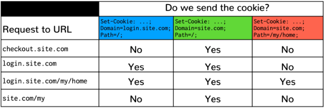
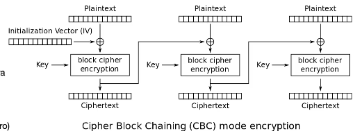
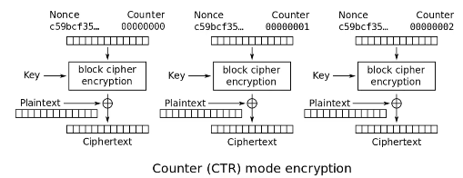
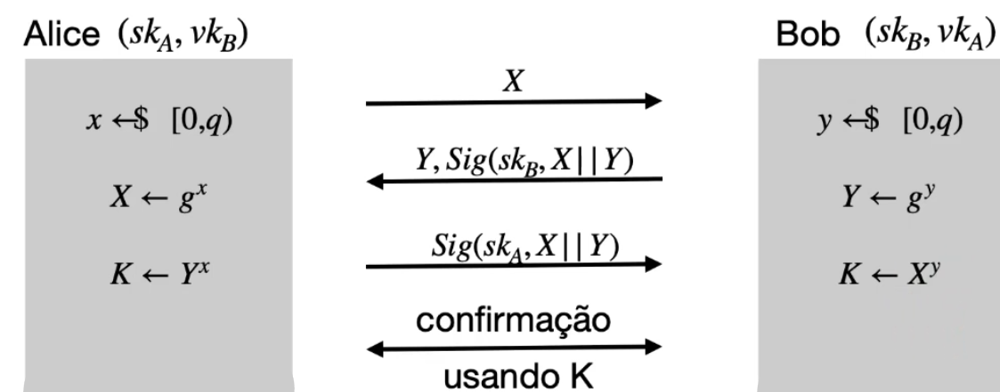

# Resumo FSI pt.2

## Protocol HTTP

- **URL** - identifica recursos de forma uniforme:
  - esquema (http, https, etc..);
  - domínio (aaa.bbb.cc), potencialmente com uma porta específica;
  - caminho para o recurso (path);
  - info extra (GET ou fragmento).
- GET, POST, PUT, PATCH, DELETE;
- Lógica foi subvertida:
  - GET tem side-effects;
  - POST é utilizado para quase tudo;
  - É preciso reconhecer pedidos relacionados => user guarda cookies que envia
    em todos os pedidos.

### Modelo de Execução

- Uma janela do browser pode ter conteúdos de diferentes origens:
  - Frames e iFrames;
  - delegar uma área do ecrã para outra origem;
  - aproveita proteção do browser para isolamento de frames;
  - isolamento permite página mãe funcionar mesmo que frame falhe.
- JS pode alterar o DOM;

## Atacantes

- **externo/rede** - só controla o meio de comunicação;
- **interno/web** - controla parta da web app:

## Analogia browser/sistema operativo

| SO            | Web            |
| ------------- | -------------- |
| Processos     | Páginas        |
| Ficheiros     | Cookies        |
| Sockets/TCP   | Fetch/HTTP     |
| Sub-processos | Frames/iFrames |

- **Origem** - contexto de isolamento que corresponde a fronteira de confiança
  na Web;

### Same Origin Policy (SOP)

- **confidencialidade** - dados de uma origem não podem ser acedidos por código
  de origem diferente;
- **integridade** - dados de uma origem não podem ser alterados por código com
  um origem diferente).
- no **DOM**: cada frame tem uma origem (esquema, domínio, porta) + código numa
  frame só pode aceder a dados com a mesma origem;
- **mensagens** - frames podem comunicar entre si;
- **cookies** só são enviados pelo browser para servidores com a mesma origem
  que as criou;

#### SOP para pedidos a server

- Uma página/frame pode fazer pedidos HTTP fora do seu domínio;
- Escrita geralmente permitida;
- O embedding de recursos de outras origens é geralmente permitido;
- Dados da resposta:
  - podem ser processados nativamente pelo browser;
  - não podem ser analisados programaticamente (por princípio);
  - mas o embedding expõem alguma informação.
- **Exemplos**:
  - HTML:
    - podemos criar frames com código HTML de outras origens;
    - não podemos inspecionar ou modificar o conteúdo da frame;
  - JS:
    - podemos obter scripts de outras origens;
    - podemos executar scripts de outras origens (no contexto da nossa origem);
    - não deve ser possível JS executado no contexto de uma origem
      inspecionar/manipular código JS carregado de outra origem (duvidoso pk
      certas plataformas permitem toString);
  - Foto pessoal pode ter tamanho diferente quando logged-in;

#### CORS

- **Problema:** SOP é muito restritivo;
- Um server, B, pode autorizar o browser a permitir que página que vem de A
  aceda a recursos de B:
  - Access-Control-Allow-Origin;
  - Não devem causar side-effects em B;
  - Browser faz pedido e verifica se resposta autoriza o uso;
- Pedidos _pre-flighted_ de site A:
  - Browser faz pedido **dummy** a B para saber se pode mesmo fazer o pedido de
    A;

#### SOP para cookies

- A definição de origem é diferente: domínio + path + esquema (opcional);
- **Write-up** - página pode definir cookie para seu domínio ou para domínios
  hierarquicamente superiores (exceto sufixos públicos).
- Envio de cookies:
  - **Tradicionalmente** - se domínio da cookie for um sufixo do domínio da
    URL + se a path da cookie for um prefixo da path da URL;
  - **Recente** - funciona assim apenas se SameSite=None.
- **Secure cookies** - (uma tag) apenas enviadas por https.

##### SameSite

- **Strict** - apenas envia cookie quando o pedido tem a mesma origem que a
  top-level frame;
- **Lax** - distingue alguns pedidos e abre exceções _cross domain_ para o envio
  de cookies;

## Cross-Site Request Forgery (CSRF)

**Problema:** servidor é um alvo e não sabe se quem fez um pedido é um
utilizador legitimo ou um atacante em seu nome.

- **Session hijacking** - atacante observa a cookie na rede e rouba (HTTPS
  previne);
- **HTTPOnly** - tag de cookie faz com que JS não lhe possa aceder;
- Atacante pode por um link malicioso numa ``: nao a consegue ver no JS mas
  o pedido é executado;
- Atacante pode fazer login no Google na máquina alvo e ficar com o histórico do
  user na sua conta;

**Solução**: CSRF tokens. Server devolve no HTML uma string aleatória que JS não
consegue ler e devolve no POST ao server. + SameSite = Strict.

## Injeção de comandos

- **Base assumption:**
  - input não é validado;
  - input malicioso causa sequência de execução anómala (código escolhido por
    atacante);
- Tanto JS como PHP têm chamadas à shell/execução de código: input tem de set
  validado;

### SQL Injection

- Server-side scripting gera dinamicamente cmds SQL;
- Facil de resolver: **prepared statements** or **ORM**;
- comentários `--`, `;` terminação, `AND`, `NOT`, `OR`;
- Nunca criar comandos SQL dinâmicamente como strings;

## Cross Site Scripting (XSS)

- Injeção de código no lado do cliente;
- Atacante consegue que um site legítimo (confiado pelo cliente) envie código
  malicioso para o browser do cliente;
- **DOM Based** - E.g. URL causa JS to mis-behave (nunca sai do browser);
- **Reflected XSS** - atacante faz pedido a site legítimo e a payload maliciosa
  é refletida para executar na máquina do cliente. E.g. procurar JS string no
  google que executa no "You searched for ...";
- **Stored XSS** - atacante armazenou payload maliciosa num recurso armazenado
  no site legimo.

**Solução:** filtrar tudo + Content Security Policy (CSP) (mandar com requests a
white-list de JS que pode correr na página) + Subresource integrity (incluir
hash dos recursos para verificar que não foram alterados in-transit);  
**Nota:** CSP tem outros usos tipo não permitir que site seja framed
(frame-ancestors 'none');

## Criptografia

- Proteção da info em trânsito (on-line/síncrono = HTTPS + off-line/assíncrono =
  email) e em repouso (disk encryption);
- **Confidencialidade** - info acessível apenas a emissor e recetor (cifras
  simétricas e assimétricas);
- **Autenticidade** (e integridade) - recetor tem a certeza que dados de um
  emissor específico e não foram alterados (assinaturas);
- **Não repúdio** - emissor não pode negar ter enviado (assinaturas digitais).

### Cifras simétricas

- Usamos a mesma cifra dos 2 lados, k, secreta;
- Usa **nonce** (público) que é mudado a cada uso da chave;
- Chave hoje em dia tipicamente 128 bits => maior que a capacidade computacional
  da humanidade atualmente;
- **One-time key** - chave usada só uma vez (nonce pode ser fixado a 0). E.g.
  email cifrado com chave fresca para cada mensagem;
- **Many-time key** - chave usada muitas vezes. E.g. cifrar disco, HTTPS/TLS;

#### Cifras Sequenciais

- `PRG(k)` (one-way function) para aumentar a chave até ao tamanho do conteúdo a
  encriptar.
- Sem nonce, basta conhecer 1 mensagem e seu texto cifrado para conhecer a chave
  (só fazer XOR again): `E(k, m) = m XOR PRG(k)`
- Usamos nonce para poder reutilizar chave: `PRF(k, n)`.

#### Cifras de Bloco

- Dado um bloco e uma chave => produz outro bloco da mesmo tamanho;

##### AES

- Ainda ninguem provou o contrario: o output do **AES** parece aleatório
  independentemente se conhecemos o input ou não.
- **AES** pega numa chave e deriva várias chaves. Cada chave faz 10 rondas num
  bloco.

---

- Se usarmos a mesma chave para todos os bloco => mesmo bloco da o mesmo output
  => não é seguro (ECB).

- **Initialization Vector (IV)** (máscara) - Antes de passar para o passo de
  encriptação, fazemos XOR com este vector. O vector para os blocos seguintes
  depende do resultado da encriptação do bloco atual. Cipher Block Chaining
  (CBC). O IV (inicial) é público;

- **Counter (CTR) mode encryption** - Mais usado hoje em dia pk é mais rápido
  (pode ser paralelizado).
- Tem nonce e counter que depois de passar pelo cipher é um gerador de números
  aleatórios;

### Message Authentication Codes

- **Problema:** Cifra não garante integridade da mensagem (atacante pode fazer
  um bit flip manhoso);
- **Solução:** MAC - algoritmo público e standard - **autenticidade** +
  **integridade**;
- k = chave secreta (128 bits);
- m, t = Mensagem pública, tag pequena (256 bit) (checksum criptografica).
- Não permite detetar (por si só) omissões, nem repetições de mensagens:
  garantir que cada mensagem da Alice só é enviada 1 vez => dar prepend de um
  número de sequência => `t = MAC(k,n||m)`.

#### HMAC

- `t = H(okey || H(ikey|m))`.
- usa SHA-256
- t => 256 bits;
- keys são pad por `o_pad` e `i_pad`.

### Confidencialidade e Autenticidade

- Combinamos cifras e MACs;
- Precisamos de 2 chaves;
- 3 hipótese (todas seguras):
  - Encrypt and MAC (E.g. SSH) - calcula ambos sobre a mensagem e envia. MAC
    pode revelar informação sobre o plaintext. Pode sofrer ataques no cipher
    (chosen-ciphertext attack);
  - MAC Then Encrypt (E.g. SSL) - primeiro MAC e depois encriptar tagged
    message. Tem um problema em que primeiro temos de desincriptar e depois
    calcular o MAC (temos em memória dados que não foram validados);
  - **Encrypt Then MAC** (E.g. IPSEC) - MAC sobre a mensagem encriptada.
    Vantagem que só deciframos se MAC for autêntico;

### Authenticated Encryption with Associated Data (AEAD)

- `Enc(n, k, m, data) => (c, t)`;
- `Dec(n, k, c, t) => m`, mas apenas se (c, data) autênticos;
- Chave pode ser usada múltiplas vezes se `n` não repetir;
- `data` utilizada para vincular criptograma a contexto, e.g. (IP, número de
  sequênia);
- Otimizável para pipelines e assim.

### Aleatoriedade

- Na criptografia assume-se aleatoridade perfeita: bit tem 50% de chance de ser
  0 ou 1;
- SO tem fontes de entropia (muito lento): medição de strings de bits a partir
  de processos físicos, temperatura, atividade do CPU, atividade do user, etc...
- SO tem geradores pseudo-aleatórios (fast):
  - estado - inicializado e atualizado periodicamente com fontes de entropia;
  - algoritmo realimentado invocado quando SO precisa (produz bits
    pseudoaleatórios + atualiza estado);
- segurança disto é heurística: best effort.

#### /dev/random vs. /dev/urandom

- random dá block até ter entropia suficiente;
- urandom não dá block => não verifica se tem entropia suficiente;
- É recomendado usar **urandom** porque:
  - devolve sempre data;
  - é discutível se o mecanismo de mediar aleatoriedade tem algum significado;
  - random pode não devolver nada (tipo malloc a dar NULL).

### Cifras assimétricas

**Problema:** N agentes daria $\frac{N * (N - 1)}{2}$ chaves.

#### Gestão de chaves

- **sistema fechado** - Temos um server central **KDC** (key distribution
  center) que cada client partilha uma chave de longa-duração com KDC => N
  chaves. A quer falar com B => A fala com KDC e KDC com B para estabelecer uma
  chave efémera entre os 2. Não escala;
- **Chaves de sessão** - chave efémera. Danos limitados se comprometidos. Não
  precisam de tanta segurança de storage como as chaves de longa duração.

---

- Quando sistema é **aberto**:
  - Assíncrono => cifras de chave pública;
  - Síncrono => acordos de chave + assinaturas digitais;
  - **Não repúdio** => assinaturas digitais.
- Tentar evitar chave pública em favor de criptografia de chave simétrica
  (economia dos mecanismos).
- `Enc(pk, m)`, `Dec(sk, c)`
- São mais ineficientes: chaves de milhares de bits + apenas viável cifrar
  mensagens muito pequenas.
- Paradigma **híbrido**:
  1. emissor gera chave de sessão simétrica e cifra a mensagem;
  2. emissor conhece chave pública do recetor (pk cifra chave de sessão);
  3. recetor obtém dois criptogramas: recupera chave de sessão, **k**, usando
     **sk** e a mensagem usando **k**.

#### Assinaturas digitais

- Só quem assinou conhece a **sk** então temos **não repúdio**.
- Em cripto simétrica há 2 pessoas que conhecem a chave, **k**, então o **MAC**
  não garante o **não repúdio**.
- **Assinar** - dar **hash** à mensagem e depois encriptar com chave privada.
- **Verificar assinatura** - Desencriptar a mensagem e a assinatura. Dar hash à
  mensagem e ver se é igual à assinatura.

#### Envelopes Digitais

- Combinar cifras assimétricas com assinaturas digitais.
- Para garantir o **não repúdio**, quem assina deve assinar a mensagem: se não
  podia alegar que assinou mas não conhecia o conteúdo.
- A Alice deve assinar toda a meta-data. Isto deve incluir o destinatário.
- How to:
  1. Dar prepend do recetor à mensagem;
  2. Assinar recetor + mensagem (usando minha sk);
  3. Encriptar recetor + mensagem + assinatura (usando pk do recetor).

### Cenário de acordo de chaves

- A e B querem uma chave de sessão com certas propriedades:
  - **confidencial** - só A e B conhecem;
  - **confirmada** - sabem que ambos conhecem a chave;
  - **perfect forward secrecy** - comprometer chaves de longa duração, não
    compromete sessões passadas.
- O **não-repúdio** **não é um objectivo**. Muitas vezes queremos
  **deniability**.

#### Protocol Diffie-Hellman

- $(G, g, °)$, públicos;
- $K = (g^y)^x = g^{y * x} = g^{x * y} = (g^x)^y = K$
- Alice escolhe $x$ e Bob escolhe $y$ - [0,q);
- Alice comunica $X = g^x$ a Bob, e Bob comunica $Y = g^y$ a Alice;
- Alice $K = Y^x$, e Bob $K = X^y$;
- Assumimos que o logaritmico discreto é hard: reverter $g^x$ e $g^y$;
- Dámos hash a K para ter um tamanho fixo => chave simétrica.

##### Man-in-the-Middle Attack

- Nada no Diffie-Hellman identifica a Alice e o Bob;
- Alguém interseta a comunicação dos 2 e negoceia um Diffie-Hellman para cada um
  => indetectável; Só podemos resolver com chaves de longa duração.
- Alice tem (skA, vkB) e Bob tem (skB, vkA).

- A confirmação das chaves faz-se no fim partilhando um conjunto de mensagens
  encriptadas com a chave acordada.

---

#### Estabelecimento de Canais Seguros

- autenticação de chaves públicas => protegem acordo de chaves;
- protocolo de acordo de chaves:
  - propaga autenticidade de chaves públicas para chave simétrica;
  - protege chave simétrica quanto a confidencialidade;
  - mesmo que chaves de assinatura sejam comprometidas no futuro.
- Cifras simétricas para troca eficiente de info com confidencial e
  autenticidade.

## Public-Key Infrastructure (PKI)

- Criptografia pressupões chaves públicas autênticas =case contrário=>
  Man-in-the-Middle;
- **PKI** quando é necessário cobertura legal/regulamentar: tem normas, leis e
  regulamentos;
- **TTP** - Truted Third Party.

### Certificados de Chave Pública

- **Nota:** certificados podem ter extensões. Se extensão for marcada como
  crítica (flag), não posso aceitar o certificado se não a souber interpretar.

#### How to

1. Alice prova a CA que possui **pk**:

- assina um pedido de certificado que contem pk usando a chave secreta **OU**
- simplesmente porque CA fornece **pk** e chave secreta a Alice.

2. CA fixa/verifica todos os dados relevantes para o certificado:

- Identidade de Alice + chave pública de Alice;
- Info específica da CA (ID e novo número de série);
- Validade (início e fim).

3. CA assina documento eletrónico com esta informação.

---

- Assinatura digital garante a Bob que a informação veio de CA/TTP => CA pode
  estar off-line;
- Bob pode obter o certificado via Alice;
- Podemos transferir certificados por canais inseguros;

#### Verificação de Certificados

Tech resolve 1, 2, e 3. PKI resolve 4 e 5.

1. Verificar correção de indentidade da Alice (domain do site é igual ao do
   certificado);
2. Verificar validade;
3. Verificar meta-informação (específico para cada aplicação);
4. Verificar que CA é de confiança;
5. Obter chave pública da CA para verificar assinatura no certificado.

---

### PKI

User de um cerificado (end entity) recebe garantia, por parte da autoridade de
certificação, de confiança de que uma chave pública pertence a outra entidade
(pessoa, servidor) e pode ser utilizada. A finalidade da utilização, as
responsabilidades, e as obrigações são bem definidas para todos.

- Numa PKI todas as chaves públicas (utilizadores e CA) são codificadas em
  certificados X.509;
- Chaves públicas de CAs têm uma indicação diferente.
- Bob confia no certificado da Alice porque confia na CA que assinou o
  certificado da Alice;
- **System Roots** - os certificados das CA podem vir já incluidos nos SO's,
  softwares e assim. Estes certificados não precisam de ser verificados
  (implicitamente confiados) => são self-signed.
- Self-signed são saltos de fé => só confiamos nos que vêm de fontes seguras.

#### Cadeia de Certificado

- Os Root CAs não emitem diretamente certificados para utilizadores finais =>
  hieraquia;
- Racional: a chave privada é tal forma crítica que não pode ser usada muitas
  vezes.
- Se CA com nome A assina CA com nome B, então confiança em B é igual ou menor
  que a confiança em A ($B <= A$).
- Verificamos o cert de A, depois o CA desse cert, depois o CA do CA do cert,
  etc... Até chegar a um CA que já conheços e confiamos.

#### Revogação de certificados

- **Problema:** Certificado já não é valido mas está dentro da data de validade.
- 3 soluções:
  - TLS - uma white-list de certificados. Não escala;
  - OCSP - serviço seguro que verifica estado de revogação. Problemas de
    privacidade;
  - Certificate pinning - web servers/browsers/aplicações generem white-lists
    próprias. Permitem identificar certificados mais importantes para entidades
    críticas.

## Autenticação

- Auth de origem de mensagens => assinaturas e MACs. Não existe requisito de
  tempo (mensagem enviada agora/recentemente).
- **Autenticação de entidades** - Bob tem a certeza que Alice participou
  ativamente/agora num passo processual. Geralmente seguido de um passo de
  autorização.

### Solução criptográfica - Desafio-Resposta

- Bob cria um desafio;
- Alice assina digitalmente ou calcula um MAC sobre o desafio e devolve;
- Bob verifica assinatura/MAC dentro de um tempo limite.

### Autenticação de Utilizadores (Humano)

Parecido com desafio-resposta.

- User fornece identidade e pede acesso;
- Server remoto solicita prova de identidade;
- Utilizador fornece prova de identidade.

#### Provas de identidade

- algo que se sabe/conhece (e.g. password, PIN, perguntas tipo nome de pet);
- algo que se possui (e.g. smartcard, telemóvel);
- algo que se é intrinsecamente (e.g. biometria);
- Podem sem combinadas (multi-factor).

### Passwords

- Solução legacy e simples;
- Atacante passivo (escuta) => precisamos de canal seguro;
- Atacante ativo (faz-se passar por servidor) => Alice precise de certeza que
  está a falar com o servidor.

#### Armazenar passwords

- Server não deve saber a password => só precisa de a saber reconhecer;
- Basta guardar `H(pw)` (função de hash critográfica);
- **Problema:** password iguais têm a mesma hash => dictionary attacks;
- **Solução:** salt (`r`) => armazenamos `(r, H(r||pw))`. O salt é aleatório e
  (idealmente) único para cada utilizador. Data breaches não ajudar a
  pré-computar tabelas para atacar outros servidores.
- As funções de Hash têm de ser especiais para não fazer algoritmos super
  eficientes: PBKDF2, bcrypt, scrypt.

### Smartcards

- Não é muito utilizado pk é preciso ter um leitor de cartão;
- Cartão tem um processador e memória;
- Cartão pode armazenar e processar chaves critográficas;
- Smartcard costuma ter um fator de autenticação extra: **PIN**;

### One-Time Tokens e One-Time Passcodes

- Hardware e App no tele;
- Hardware/tele pode ser roubado;
- No tele é mais barato mas pode estar a centralizar tudo;

### Biometria

- **física** - impressão digital, forma da iris, face...
- **comportamental** - caligrafia, uso do teclado...
- **combinação de ambas** - voz, forma de andar...
- **Problemas:** privacidade e direito ao esquecimento.
- 3 formas:
  - cliente envia tudo para server para ser processado (confia tudo no server);
  - server recebe templates/caractrísticas para match (compromisso);
  - cliente faz match local e avisa server (server confia tudo no cliente). E.g.
    user pode ter cartão do server em que é preciso impressão digital para fazer
    o matching local.
- **FAR** - falsos positivos - probabilidade de aceitar indevidamente;
- **FRR** - falsos negativos - probabilidade de rejeitar indevidamente;
- Há trade-offs então tenta-se equilibrar Equal Error Rate Point (FAR = FRR).

### Sessão

- Sem sessão, todos os pedidos exigiriam nova autenticação;
- **HTTP auth** - browser guarda user e pass e quando server pede auth. Em cada
  pedido o browser manda authenticação em todos os pedidos aquelas pasta no
  server. **Problemas:** Log-out implica fechar o browser + site não controla
  form de login então o user pode ser enganado.

#### Tokens de sessão

- Server cria um _testemunho_ que fica guardado do lado do cliente e é devolvido
  em todos os pedidos relacionados: cookie, info nos links clicáveis, campos
  escondidos em formulários;
- Devem ser imprevisiveis e invalidados em logout;
- Ataques de roubo: XSS, MitM em HTTP, falha de logout (token não invalidado no
  servidor);
  - Mitigação: ligar token à máquina, e.g. IP (pode causar logout acidental).
- Ataques de token fixation: atacante inicia sessão (low privilege) e recebe
  token e _convence_ user a fazer login com o mesmo token => atacante passa a
  ter privilegios do user;
  - Mitigação: nunca elevar privilégios/fazer login sem criar um token novo.

## Segurança de redes

- É comum camadas superiores encapsularem camadas inferiores;
- ARP para determinar MACs na rede local (traduz IP para MAC);
- Routing a nivel global é também baseado na boa vontade (gossip da rouing
  info);
- TCP tem o triple-handshake (SYN ->; SYN ACK <-; ACK ->): decisão do número de
  sequênia importa para segurança;
  - Qualquer um que saiba sequence number pode mandar FIN ou RST e terminar
    ligação.
- DNS (usa UDP). Variantes seguras são quase não utilizadas. Cache poisoning é
  grave em DNS;
- Ataques potenciais a todos os níveis da rede;
- Rede **não tem confidencialidade** => precisamos de **end-to-end** protection;

### Atacks

- **upstream** - packet sniffing nos cabos no oceano;
- **prism** - US a sniffar a info dos servers em seu território;
- **MAC flooding** - inundar switch de novos MACs (para ele tirar os endereços
  reais da cache), e assim o switch começa a enviar os pacote que recebe para o
  broadcast (best effort);
- **MAC spoofing** - usurpar MAC address (é só configurar a placa de rede) - não
  existe autenticação;
- **ARP poisoning/spoofing** - (é tipo o de MAC) abusa do cache das máquinas;
- **ICMP Router Discovery Protocoll (IRDP)** - descobrir router na rede.
  **IRDP** spoofing permite anunciar router falso;
- **Rogue DHCP** - dar assign a fake IP;
- **DNS** - nada é autenticado (DNSSEC é raro);
  - **spoofing** - Primeiro usurparmos DNS no cliente (DHCP malicioso). Depois
    dá-mos link a endereços para fake IPs;
  - **poisoning** - brute-force de endereços (não sabemos o query ID) para o
    servidor local de DNS dar cache a shit.

### Terminação de Ligações

- Em TCP basta pacote ter formato correto que é aceito (endereços e nº de seq);
- Ataque: terminar ligações indesejadas (RST msg), e.g. Great Firewall of China;
  - Para este tipo de ataques é importante controlar parte da infra-estrutura.

### Spoofing às cegas (off path)

- Estabelecer session em nome de uma origem que não controlamos:
  - enviar msg inicial SYN;
  - não conseguimos ver o nº de seq na resposta;
  - adivinhamos o número de seq (muitas vezes baseado no relógio);
  - **Mitigação:** user nºs de seq aleatórios;

### TCP Session hijacking

- Usurpação de uma sessão legítima por parte de um atacante;
- Deixamos as 2 parties autenticar-se mutuamente e depois usurpamos;
- 3 Fases:
  - Tracking - tentar perceber em que estado está sessão (estar no estado que
    queremos) (**sniffing**);
  - Des-sincronização - metemo-nos no meio e tornamos as parties incapazes de
    comunicar uma com a outra (avançar o seq nº do servidor com msg => força
    parties a tentar re-sincronizar);
  - Injeção - comunicar com elas;
- Fácil de executar se tivermos infraestrutura sobre o nosso controlo;
- **Dificuldades:** intrometer no momento certo, remover alvo do sistema =>
  saber tanto sobre a sessão como o alvo (incluindo TCP seq nºs);

### UDP Hijacking

- Não tem controlo de tráfego;
- É mais facil pk há menos info que temos de saber;

### Defesas

- **Firewall** - fronteira entre organização e internet;
- Sempre: proteger rede interna de ameaças externas;
- Por vezes: proteger rede interna de máquina locais infetadas;

#### Firewalls

- Tipicamente olham para os cabeçalhos dos pacotes: IP, protocolo, portas;
- Tentam eliminar comunicações maliciosas;
- Protegem máquinas internos de acesso externo;
- Fornecem às máquinas internas funcionalidades que exigem acesso externo;
- **Proxies:** são diferentes porque trabalham ao nível de uma aplicação
  específica.

##### Políticas de Controlo de Acessos

- Distingue tráfego recebido de enviado;
- **Política simples:**
  - Permite todos os acessos de dentro para fora;
  - Restringe acessos de fora para dentro - permitir só serviços explicitos para
    exposição.
- Como tratar tráfego que não referido explicitamente nas políticas:
  - **Default allow**;
  - **Default deny** => provoca instabilidade inicial mas é melhor.

#### Filtragem de Pacotes

- Cada pacote é verificado relativamente a regras => forward/drop;
- Usa-se info das camadas de rede e de transporte;
- Bloquear propagação de DNS (53), HTTPS(443);
- 2 tipos:
  - **sem estado** - não tem em conta se pacotes estão no contexto de uma
    ligação => tem de ser mais permissiva;
  - **com estado** - (hard para contextos elaborados) tenta manter registo de
    ligações ativas para verificar se pacote faz sentido ness contexto. E.g.
    máquina faz pedido ao exterior e expera resposta.
- **Contornar:** usar uma porta de outro serviço (tunnel). Encapsular um
  protocolo dentro de outro protocolo (e.g. SSH, VPN, etc..).

#### NAT

- (IP, porta) internos => porta na rede pública;
- Mensagem enviada para o exterior:
  - verifica se tabela contém porta pública => senão cria entrada;
  - traduz (IP, porta) internos => (endereço router, porta pública).
- Mensagem recebida do exterior:
  - verifica se tabela contém porta pública => senão faz drop;
  - traduz (endereço router, porta pública) => (IP, porta) internos.
- **Vantagens:** reduz exposição ao exterior;
- **Desvantagens:** pode perturbar funcionamento de alguns protocolos + fácil de
  fazer bypass por atacante ativo (site corre JS que envia mensagens para fora
  que baralha NAT).

#### Proxies de aplicação

- MitM do bem;
- Adiciona verificações a pacotes para uma aplicação.

#### Network IDS/IPS

- Tabela de ligações ativas que acompanha o estado;
- Procurar padrões (parciais) como `/etc/passwd`;
- **Vantagem:** não é necessário alterar máquinas individuais;
- **Desvantagem:** exigente em termos de processamento em ligações de alto
  débito + menos precisão.

#### Host-Based IDS/IPS

- Fazer deteção mais profunda em algumas máquinas.

#### Análise de Logs

- E.g. fail2ban;
- Correm off-line e analisam a interpretação dos servidores/máquinas;
- **apenas reativo**;
- Atacante pode modificar os próprios logs;
- Podem ser utilizados para atualizar regras de firewalls/IDS => perigo de
  self-block;

## TLS

- Assumimos que atacante controla tudo na rede;
- Handshake TLS1.3 = Diffie-Hellman autenticado;
- **Perfect forward secrecy:**
  - chaves de longa duração são utilizadas para assinaturas e não para
    transporte de chaves de sessão;
  - comprometer uma chave de longa duração não compromete acordos de chaves
    passados;

### TLS implica PKI

- Servidor autentica a troca DH com assinatura digital (assinatura do cliente é
  opcional);
- Server envia o seu certificado de chave pública;
- Cliente verifica a validade do certificado. **Nota:** wildcard só dá match a
  uma palavra, e.g., para `*.padoru.pt`, `eu.sou.padoru.pt` não é válido;
- Cliente utiliza chave pública no certificado para verifica assinatura digital;
- **Cliente não autenticado => server não sabe com quem fala.**

### Handshake

- **ClientHello** - `->` - nonceC + KeyShare (X);
- **ServerHello** - `<-` - nonceS + KeyShare (Y), Enc[certS, certCA, ...]. Certs
  vêm encriptados para anonimizar o site onde cliente fez pedido;
- **CertVerify** - `<-` - Enc[SignS(dados)]. Dados do DH para autenticar o
  servidor;
- Usar KDF com (DHKey, nonceC, nonceS) para gerar chaves de sessão.
- **Optimização** - `0-RTT` - usando chaves de sessão antigas, podemos mandar
  dados cifrados logo no início da comunicação. BAD!!!!!!!!

### Integração TLS/HTTP

- Mensagens HTTP são transmitidas usualmente como payloads TLS (depois do canal
  ser estabelecido);
- **Problemas/Soluções:**
  - web proxy - precisa de saber o cabeçalho HTTP para estabelecer ligação.
    Client envia nome de comínio antes do client-hello do TLS;
  - virtual hosts - mesmo IP com múltiplos DNS:
    - old: client-hello inclui nome de domínio do servidor;
    - futuro: nome de domínio cifrado com chave pública proviniente do DNS =>
      tenta preservar privacidade do nome de domínio (certificado cifrado);
- Antigamente não se usava sempre HTTPS por causa de performance (RSA), mas hoje
  em dia já devia ser usado em tudo;
- **SSL Strip Attack** - ir para site em http que redireciona para https, mas
  tem MitM que interceta. User fala em HTTP para atacante e em HTTPS para o site
  => aviso de mixed content na página.
