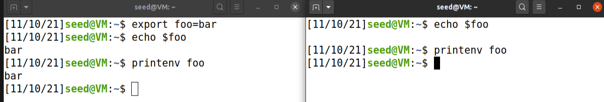
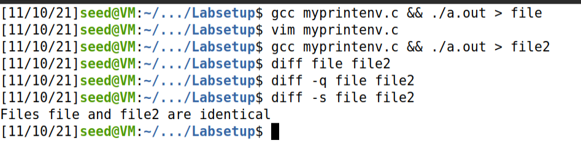
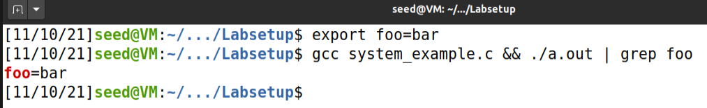
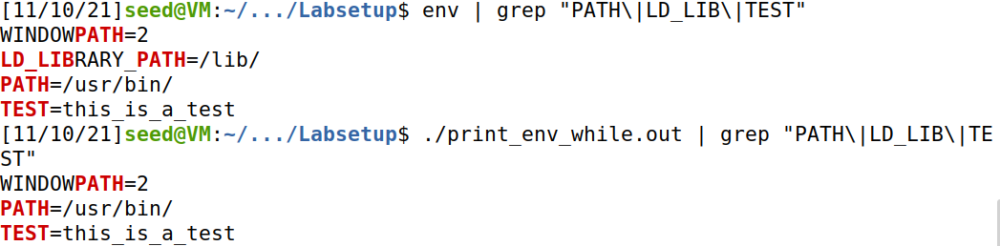
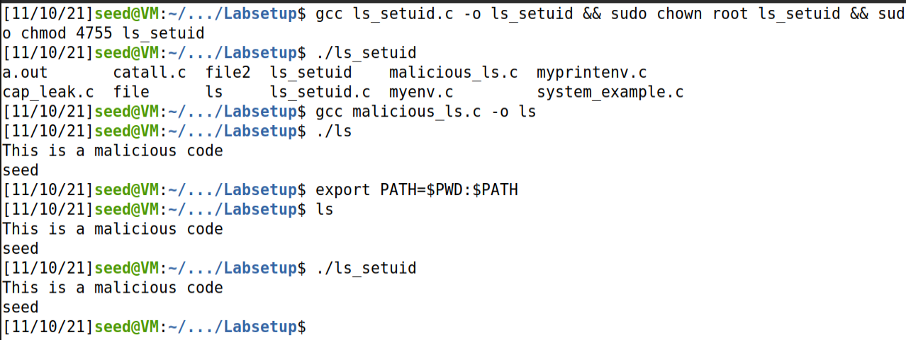
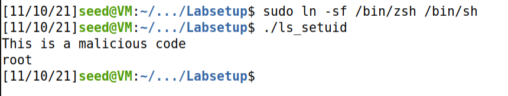

# Log book 4

## Task 1

`printenv` and `env` have different use cases, but their raw usage (no cmd line
arguments) yields the same output: a list of all the environment variables
currently set and their values (one variable per line).

We can use bash's export and unset to manipulate the environment variables of
the current session. It should be noted that these manipulations aren't kept
between sessions, e.g.: calling `export foo=bar` in a terminal running bash and
`printenv foo` in another won't output anything.

## Task 2

In this task we are presented with a simple C program that forks itself and
prints the environment. In the first run the child process (fork) prints its
environment to **STDOUT**. In the second run the parent process does the same.  
By comparing the output of the two runs, we can see that both are the same. This
means that a child process inherits the environment of its parent.



## Task 3

In this task, we are asked to run a simple program which uses the `execve()`
function and to observe its output. This program executes a program called
`/usr/bin/env` which prints out the environment variables of the current
process.

Upon compiling and running the program, we didn't observe any output. The reason
for this is that `execve()` is being called with a NULL third argument. In the
`execve`'s man page, we can see that `execve` takes 3 different arguments:
`execve(const char*filename, char *const argv[], char* const envp[]);`. The
third argument, is an array of strings which are passed as environment to the
new program. Since we are passing to the new program a NULL pointer, there are
no environment variables to be printed by `/usr/bin/env`. However, after
changing the `execve()` as requested in the second step, the expected output
appears. The second step asks us to change the previous `execve()` call to
`execve("/usr/bin/env", argv, environ);`. This time we are actually passing the
current environment to execve() since `environ` contains the environment
variables of the process that is calling `execve()`. We also tried to change the
base program to use the `envp` variable from the `main` function which output is
equal to the one from Task 2:

```c
#include <unistd.h>

int main(int argc, char* argv[], char* envp[])
{
  argv[0] = "/usr/bin/env";
  argv[1] = NULL;

  execve("/usr/bin/env", argv, envp);

  return 0 ;
}
```

## Task 4

The C program in this task outputs the environment of the current process, as it
said in the task description (see figure below).



Since `system` spawns a shell to run the given command, it has some interesting
properties when compared to `execve` (and its derivatives). When executing a
program using `execve`, we need to provide the path to its executable file. In
the case of `system`, the spawned shell can make use of the PATH environment
variable to "know where to look" for the executable mentioned. This means that
the line `system("/usr/bin/env");` could become `system("env");` and still yield
the same results (as long as the **PATH** environment variable is intact).
Another thing of note is that, in most systems, `/bin/sh` is an alias to a
different shell. In the case of the VM used in class, it is a symlink to the
**dash** shell (as is common on Ubuntu distributions) even though the user shell
is **bash**. It is also possible to use shell specific functions in the call,
instead of just calling executables and passing them argument, e.g.:
`a=1; echo $a`.



These "extras" come with a cost. Using `system` instead of `execve` is less
efficient when the intention is just to execute a single program. It is also
affected by the user's environment, which can be dangerous.

## Task 5

### Step 1

An execution of the given code with the default environment variables and no
arguments simply prints to stdout all environment variables of the default user,
**seed**.

### Step 2

By executing the following command we are transfering ownership of the last
step's executable to the root user. This command requires extra privileges, so
we use sudo to run it.

```bash
sudo chown root foo
```

The last three digits, **755**, of the`chmod` command, are giving read, write
and execute permissions to the **owner** (7), and giving read and execute
permissions to the **group** and **others** (55). The first digit, 4, sets the
`setuid` flag. When it is set, it will set the permissions of the user executing
the file to the permissions of the owner of the file, which, due to `chown`
command, happens to be root.

```bash
sudo chown 4755 foo
```

This results in the following permissions.


### Step 3

We use the export command to set the `PATH`, `LD_LIBRARY_PATH` and `TEST`:

```bash
export PATH="/usr/bin/"
export LD_LIBRARY_PATH="/lib/"
export TEST="this_is_a_test"
```

 As described in the
image above, we can conclude that both `PATH` and `TEST` variables remain the
same, while the `LD_LIBRARY_PATH` variable isn't inherited when running the
program.

## Task 6

As we can see from the figure below, we can make the `system` function call use
our malicious code by editing the PATH environment variable (as mentioned in
Task 4). In this case, the program below (`ls_setuid.c`) calls `ls` using the
PATH environment variable:

```c
#include <stdio.h>
#include <stdlib.h>

int
main(int argc, char** argv)
{
  system("ls");
  return 0;
}
```



When we manipulate the PATH, we can make it run our malicious code instead.

The "malicious" code used:

```c
#include <stdio.h>
#include <stdlib.h>

int
main() {
  fputs("This is a malicious code\n", stdout);
  execl("/bin/whoami", "", (char *) NULL);
  return 0; // unreachable
}
```

Even tough `ls_setuid` is a SetUID program, when it calls our malicious code, we
do not have root privileges. This is a countermeasure of the **dash** shell (as
mentioned on the task description). When we change the `/bin/sh` symlink to a
different shell (in this case zsh) with `sudo ln -sf /bin/zsh /bin/sh`, we get
the expected result show below (where our malicious code run with root
privileges).



## CTF

### Software version

- WordPress 5.8.1
- WooCommerce 5.7.1

### Vulnerability identified

This version of WooCommerce is vulnerable to
[CVE-2021-34646](https://www.exploit-db.com/exploits/50299)

### Users found

On the reviews of the
[wordpress hosting](http://ctf-fsi.fe.up.pt:5001/product/wordpress-hosting/)
product, there were 2 users:

- Orval Sanford (couldn't find ID)
- admin (maybe ID 0 or 1)

### How the attack was performed

After searching on exploit-db, the vulnerability above was found. The group
tried to login as both the user with id 0 and id 1 (probable admin id's) by
using the code provided by exploit-db. Id 1 was successfully attacked.

The flag, `flag{2d1b9c9b506ee9250fb8e1b1c7dc253c}`, was in a private message
visible to the admin.
