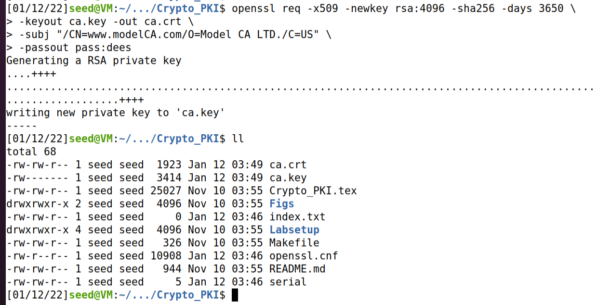
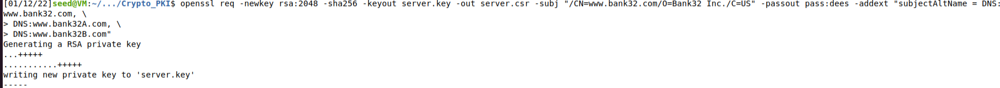
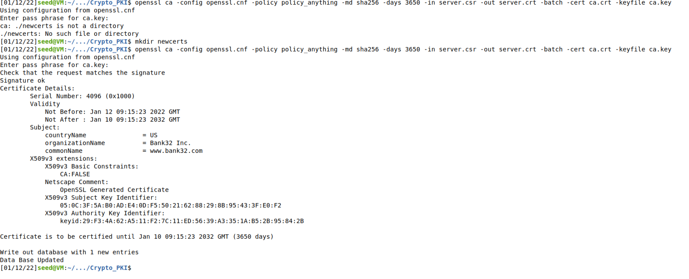
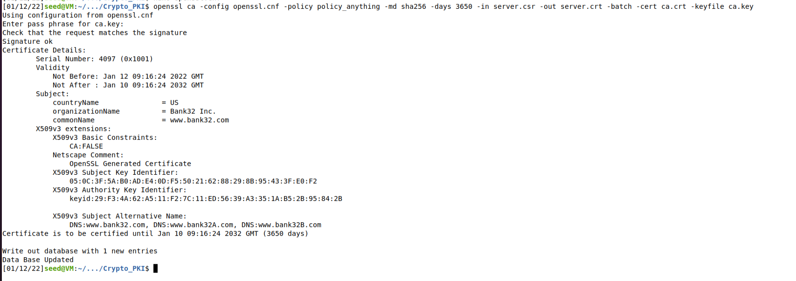
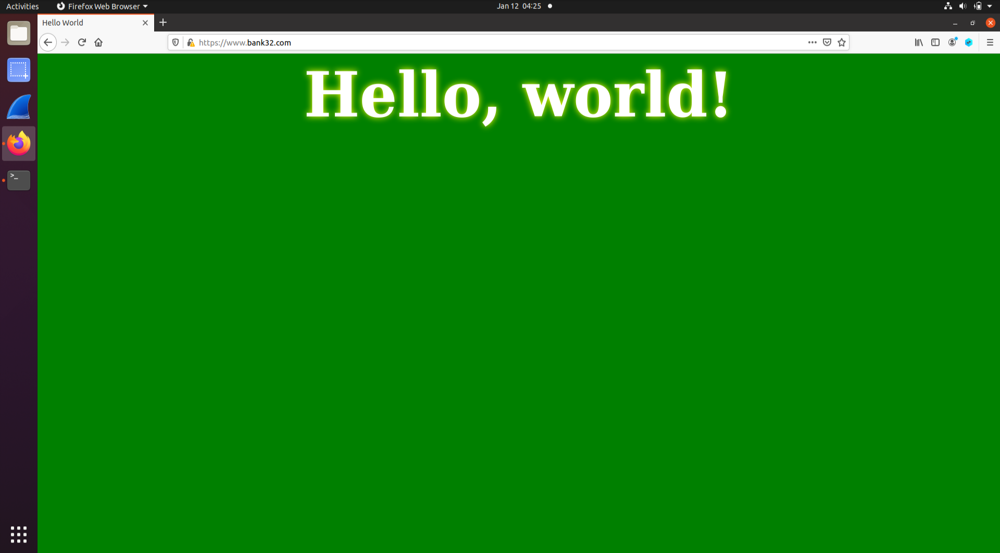
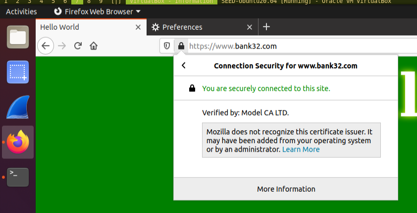
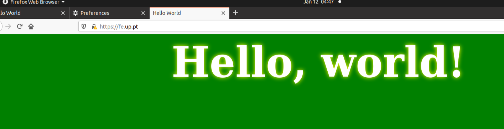
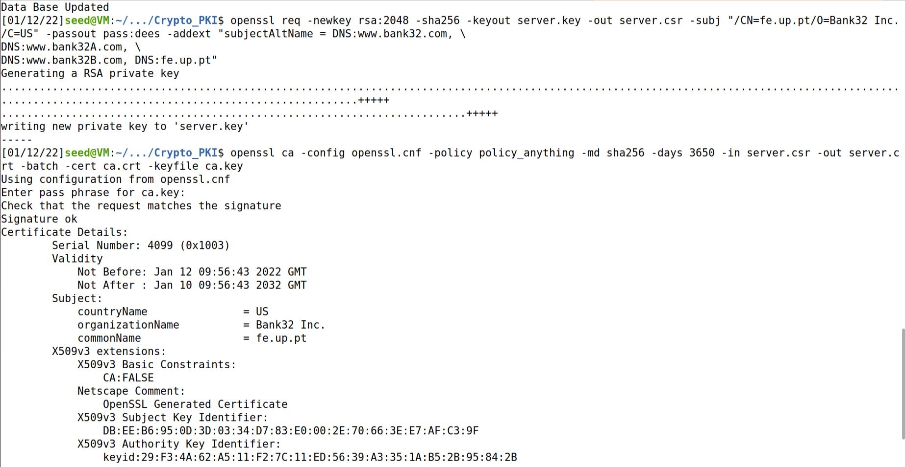
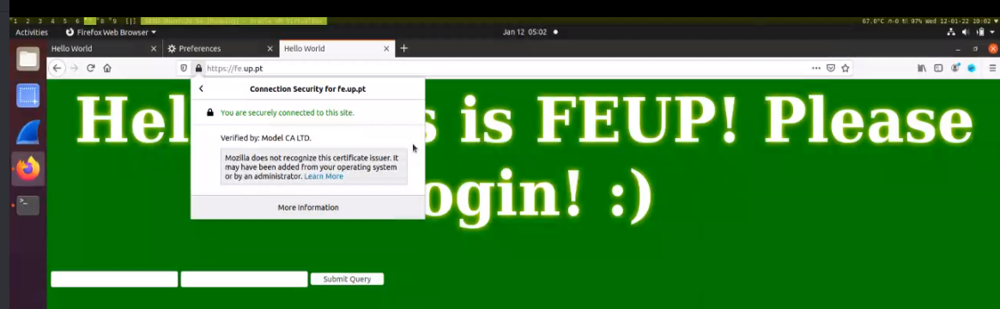

# Log Book 11

## Environment Setup

We successfuly changed the hosts file and ran the server using the
`docker-compose` commands.

## Task 1

### What part of the certificate indicates this is a CA’s certificate?

```
509v3 Basic Constraints: critical
  CA: TRUE
```

### What part of the certificate indicates this is a self-signed certificate?

The **Issuer** is the same as the **Subject**.

### In the RSA algorithm, we have a public exponent e, a private exponent d, a modulus n, and two secret numbers p and q, such that n = pq. Please identify the values for these elements in your certificate and key files.

- **public exponent, e**: 65537
- **private exponent, d**:
```
13:a6:97:97:ea:c2:5e:cb:5d:0e:22:d0:4e:bf:c7:
3b:b9:0b:f3:d7:28:a8:e6:38:7e:24:81:85:46:ee:
54:0b:a2:89:25:9d:ee:b5:b2:43:28:c3:db:eb:00:
a0:c3:a9:b8:13:00:41:b5:7d:84:25:68:cf:c0:f2:
6c:86:ce:4d:dd:67:d2:a7:9c:f0:ec:1a:2c:3f:3b:
8e:ba:b4:4b:68:d9:e2:34:57:c1:b0:25:4b:6a:3c:
ee:de:55:a1:70:58:7b:b1:54:81:d7:2d:d7:35:b2:
8a:fb:47:24:ba:c6:d9:c9:d1:9e:5c:fe:18:e4:a4:
ee:59:d5:ff:60:af:9b:c0:9d:28:5c:29:d0:5f:3c:
57:db:1f:98:ea:41:59:d1:0d:c8:d8:c8:50:4b:23:
63:a6:39:4a:99:d8:28:74:9b:1e:7b:cf:72:fe:d7:
2b:13:28:6d:36:f1:c8:76:4a:8c:2f:15:04:7b:8d:
77:01:47:52:bf:33:b6:f7:e8:ea:0c:d8:7e:49:82:
49:ec:c4:80:5a:d9:88:f2:83:f7:f1:06:0a:06:a5:
bd:f3:cf:82:c6:1d:41:94:49:92:a4:94:27:cb:1b:
60:df:4c:f3:23:61:04:ae:90:8d:cc:5b:62:1b:6f:
67:64:5c:2f:79:9b:66:bc:13:a9:fe:55:52:2c:6f:
96:ff:5b:b5:49:00:29:75:b8:71:dc:f2:1e:c1:5b:
21:e8:86:4c:7b:52:78:6a:da:68:dd:b9:2e:42:0f:
71:01:02:ac:e4:3d:ba:b2:8e:2c:bf:5d:97:c7:7a:
1f:9f:c5:54:32:89:c8:b9:96:5a:13:b8:bf:e5:e3:
d6:de:8c:a9:03:e4:7c:50:ab:ac:8b:3b:a0:37:2c:
9f:d4:94:62:b0:a5:48:e0:28:fe:cd:5e:a8:30:20:
76:a8:2b:2f:dc:22:5d:60:dd:5f:97:20:a4:b4:e2:
27:21:ce:9c:d9:5c:ad:0d:3e:31:a1:f7:9e:a5:bc:
83:b8:fd:7c:07:91:61:f7:0e:84:1b:d6:fe:69:5d:
0b:41:15:a3:b3:9f:bc:7d:66:3c:37:a4:97:94:ed:
3e:d2:92:f9:8a:85:a8:af:63:a4:5d:73:e9:4e:73:
1f:fe:02:95:4b:e0:dc:de:e9:92:5a:b9:85:38:4f:
45:9f:62:80:64:b9:88:8f:09:f1:01:ba:8b:87:50:
4a:10:05:d0:76:43:e7:fc:88:41:14:e4:ee:92:b1:
b0:83:d4:e0:ad:2a:c1:bd:4e:a8:90:d0:a7:ba:01:
b4:20:f5:b7:41:e9:41:5a:68:21:a3:86:d3:b1:cf:
3d:87:40:fd:60:72:6d:95:33:72:44:3c:78:4e:41:
2c:d1
```
- **modulus, n**:
```
00:ac:7e:d7:b1:a0:c1:71:24:d2:2c:4b:ee:39:32:
55:d7:8c:81:17:e7:31:2c:0e:96:0f:65:47:09:f5:
90:0b:dc:d6:f2:e8:2c:09:b9:ac:3a:41:f0:1d:09:
b0:2a:f0:84:9e:b6:90:95:f8:6e:0d:f3:f6:93:80:
85:3a:66:d3:84:23:94:bf:2c:c4:6c:a9:a1:3c:e0:
61:09:32:c8:51:a5:85:a0:11:59:49:fd:e8:64:ee:
1c:fa:48:6f:5c:b7:4e:1c:74:0a:42:19:16:a4:d8:
37:6f:16:e8:c0:a1:b1:04:9e:1e:97:82:3e:9b:7d:
a0:c7:a7:d2:3b:57:d0:25:dc:c8:47:a3:e8:04:26:
90:aa:e0:81:10:74:1c:64:c1:19:c8:20:f4:fe:f3:
d9:d4:4d:86:5f:27:f0:2b:3a:e4:be:55:a6:ab:cb:
f4:8b:6d:e9:a8:0f:e0:28:df:f0:b9:37:1b:e5:69:
55:54:60:39:be:40:8c:1c:1a:9a:a4:19:0c:a8:38:
87:14:0f:94:eb:9c:37:44:3c:84:4d:40:99:71:a8:
13:5c:04:07:15:62:22:b0:92:50:bf:67:b7:75:2c:
7a:7a:92:45:12:98:85:97:56:1b:71:86:ee:bb:ff:
c7:0a:58:dc:ad:49:d1:ca:5a:bd:e4:c6:4d:82:90:
35:e3:92:42:72:ef:55:76:1d:a4:6a:28:a1:c5:39:
bc:52:ef:83:74:ae:e2:d1:88:61:f2:31:b2:0c:38:
c9:3d:ca:24:03:ef:40:e5:34:4e:af:71:20:b2:27:
ed:0b:1c:87:00:5e:47:bf:96:02:16:a8:8a:f3:8a:
27:80:75:33:fe:a6:49:47:0f:d3:20:2a:12:1f:a1:
7b:7f:f5:c4:5d:82:54:1a:35:de:c8:c2:de:43:03:
d4:dc:0e:9d:46:48:22:5a:0f:b8:04:f6:09:5c:52:
8b:ce:52:ec:b9:7b:16:a2:a5:48:bd:20:5c:55:60:
30:40:e2:f1:c0:b3:5a:44:cc:6f:d7:83:a6:e6:cb:
bf:af:2f:db:89:20:f2:06:42:3f:62:b3:96:30:77:
d6:60:52:7a:5d:57:a1:41:47:61:5a:3c:e3:c6:24:
76:ff:13:f0:78:f0:4a:b7:ed:55:4d:e4:90:6f:2c:
89:9e:2b:38:ab:f4:aa:28:71:0e:06:d2:cd:b9:2c:
a3:d4:c0:2c:b8:aa:f7:d8:bd:6e:75:0f:b4:a6:78:
5f:05:66:3c:84:c5:d6:4f:8a:1e:39:40:bc:a2:f2:
93:1b:7c:38:42:e4:12:ed:fc:ad:2d:32:aa:31:46:
25:8e:16:b2:fc:55:73:af:07:3b:49:49:ea:5e:9e:
9e:8d:d3
```
- **p**:
```
00:de:69:03:e0:58:9f:21:76:12:df:90:23:18:58:
79:26:64:ed:5c:8d:87:a1:fc:48:79:cd:6e:fe:ee:
62:36:16:d2:8f:aa:1c:6c:ca:1b:16:d4:cc:7d:9c:
71:92:b0:d8:eb:30:0d:3a:1e:51:09:6b:5f:ef:44:
d6:c1:e7:cf:6b:93:97:22:ed:3f:58:60:02:72:45:
7e:e1:2c:fb:ed:b2:43:3a:2e:c0:35:d0:bc:8d:24:
75:8a:48:10:38:06:28:ed:18:f6:7e:4f:3c:19:68:
8f:d9:14:b2:27:99:8a:39:12:0a:63:d4:f2:d5:1a:
93:91:e0:ea:94:10:11:b8:70:53:5c:2e:5a:64:e5:
bd:17:a9:cf:55:3a:7d:97:b2:f5:2e:b8:e5:e1:be:
b8:9c:73:f2:64:f7:5f:d7:5b:23:79:32:72:63:21:
f1:be:e4:1c:f8:5f:39:8c:37:66:ca:cf:4a:f4:18:
e4:9c:af:86:51:df:d8:1c:6a:7c:49:eb:46:a0:6d:
e6:80:4f:8c:30:f9:46:72:a6:a4:47:d1:bc:57:2d:
2a:5d:1b:95:a6:8e:20:c1:56:ad:27:c2:aa:a8:f8:
22:f3:84:78:5a:49:df:d0:6b:01:e6:5d:e1:5b:39:
24:8b:4c:c8:f2:48:bf:b7:43:f8:b5:75:e5:05:4d:
c3:8f
```
- **q**:
```
00:c6:8b:fc:da:45:3d:ec:8c:71:92:4f:6e:93:fc:
aa:af:42:27:88:22:46:a1:a7:70:3e:eb:ad:a4:5d:
bc:5c:2b:fc:cf:c2:b5:d7:9a:8c:58:4b:ca:0f:78:
56:44:78:d2:36:55:5f:89:ef:da:65:e6:bd:24:1e:
3b:12:4b:2b:b6:82:62:53:14:31:ea:4f:2c:ee:08:
92:49:51:ef:e9:88:35:4b:db:f5:67:c3:e3:5b:fd:
74:6a:9f:23:05:8a:9e:56:4d:92:1e:91:77:0f:00:
67:f7:7c:97:9d:39:ce:7f:b7:2e:b8:18:d1:1c:c5:
aa:62:82:fb:aa:a8:da:41:4f:b6:45:ad:00:6c:38:
14:db:e2:49:37:78:b6:81:72:1b:6f:93:df:12:bc:
ef:84:96:6d:3a:6c:53:3d:8a:3b:f0:53:c2:e8:33:
6f:15:bb:41:7b:4f:1c:75:54:fe:e3:08:ab:76:13:
1e:69:6e:57:3e:76:be:08:fb:0b:67:3a:75:3a:21:
2c:4d:2c:17:02:50:60:37:28:ba:97:43:b2:1d:58:
6c:5e:2f:86:0f:52:a4:df:65:7c:57:c0:6a:2c:11:
66:4d:cc:ad:67:d2:68:3a:0f:6b:91:22:4d:03:fd:
a5:e0:36:3e:4f:7e:1e:4c:fb:61:0c:a5:6b:b8:ac:
5f:7d
```



[CA crt](./LOGBOOK11_img/ca_crt.txt)

[CA key](./LOGBOOK11_img/ca_key.txt)

## Task 2

We generated the certificate signing request (CSR).



## Task 3

The certificate was generated. The Subject Alternative Names are present in
the X509v3 Subject Alternative Name.





## Task 4

We trusted the `CA.crt`.






## Task 5

ServerName was changed to `fe.up.pt`. `10.9.0.80 fe.up.pt` was added to `/etc/hosts`.



## Task 6

When the CA is compromised, we can sign certificates ourselves and impersonate
other websites. In this case, we're impersonating `fe.up.pt`.





